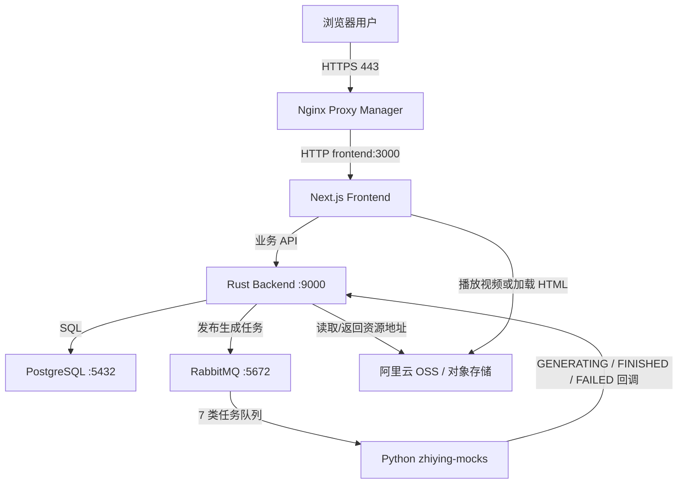
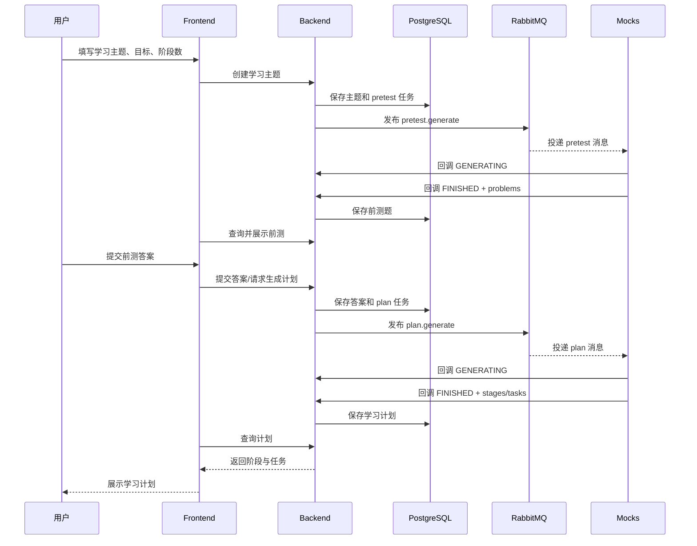

# 智映通学部署与架构简要说明

本文档记录 `zhiying.ecnu.top` 当前单机 Docker Compose 部署的整体架构、首次部署步骤、日常迭代方式，以及各服务之间的调用关系。文档不记录任何密码、Token、AccessKey 或生产 `.env` 内容。

## 1. 当前线上环境

- 公网域名：`https://zhiying.ecnu.top`
- 操作系统：Ubuntu 24.04 LTS，x86_64
- 部署方式：单机 Docker Compose
- 反向代理与 HTTPS：Nginx Proxy Manager（NPM）+ Let's Encrypt
- Compose 工作目录：`/opt/zhiying`
- 生产环境变量：`/opt/zhiying/.env`
- Docker 镜像仓库：Docker Hub，当前业务镜像位于 `fenggwsx/*`
- 服务器配置：约 1.6 GiB 内存，额外配置 2 GiB Swap

服务器内的主要容器：

| Compose 服务 | 容器 | 镜像/技术 | 作用 |
|---|---|---|---|
| `npm` | `zhiying-npm` | Nginx Proxy Manager / OpenResty | 接收公网 80/443 请求、管理域名反向代理、签发和续期 HTTPS 证书 |
| `frontend` | `zhiying-frontend` | Next.js | 用户界面、登录页、学习计划及生成结果展示 |
| `backend` | `zhiying-backend` | Rust 后端服务 | 业务 API、认证、数据库读写、任务创建、RabbitMQ 消息发布、微服务回调处理 |
| `postgres` | `zhiying-postgres` | PostgreSQL 16 | 保存用户、学习任务、题目、计划、生成任务状态等结构化业务数据 |
| `rabbitmq` | `zhiying-rabbitmq` | RabbitMQ 4 Management | 在 backend 与生成微服务之间异步传递任务 |
| `mocks` | `zhiying-mocks` | Python 3.13、aio-pika、httpx、Pydantic | 模拟 7 个 AI/内容生成微服务，消费 RabbitMQ 任务并回调 backend |

## 2. 总体架构



公网只需要开放：

- `22/tcp`：SSH，建议限制为维护人员 IP；
- `80/tcp`：HTTP 和 Let's Encrypt HTTP-01 验证；
- `443/tcp`：HTTPS。

以下端口只用于 Docker 内网，不应直接向公网开放：

- `3000`：frontend；
- `9000`：backend；
- `5432`：PostgreSQL；
- `5672`：RabbitMQ；
- `9200`：mocks 健康检查；
- `81`：NPM 管理后台，推荐通过 SSH 隧道访问。

## 3. 前端说明

- 名称：`zhiying-frontend`
- 框架：Next.js（从线上响应头 `X-Powered-By: Next.js` 及容器镜像确认）
- 容器内端口：`3000`
- 部署位置：与其他服务一起运行在云服务器的 Docker Compose 中
- 公网入口：NPM 将 `zhiying.ecnu.top` 转发到 `frontend:3000`
- 主要职责：
  - 提供登录及用户界面；
  - 发起学习主题、预检、计划、视频、讲解、测验等业务请求；
  - 展示 backend 返回的任务状态和业务数据；
  - 根据对象存储公开地址播放视频或加载交互 HTML。

NPM Proxy Host 的核心配置：

```text
Domain: zhiying.ecnu.top
Scheme: http
Forward Hostname: frontend
Forward Port: 3000
SSL: Let's Encrypt
Force SSL: enabled
```

## 4. 后端说明

- 名称：`zhiying-backend`
- 语言：Rust
- 容器内端口：`9000`
- 主要职责：
  - 用户认证和 JWT；
  - 业务 API；
  - PostgreSQL 数据读写及数据库迁移；
  - 创建生成任务并向 RabbitMQ 发布消息；
  - 接收 7 类生成服务的内部回调；
  - 校验各微服务独立的 Bearer API Key；
  - 记录任务的 `GENERATING`、`FINISHED`、`FAILED` 状态；
  - 提供对象存储的公开配置和资源地址。

backend、mocks、PostgreSQL 和 RabbitMQ 必须使用同一份 `/opt/zhiying/.env` 中的对应账号和密钥，避免出现数据库认证、RabbitMQ 认证或内部回调 401 错误。

## 5. mocks 微服务说明

当前仓库是 `zhiying-mocks`。它不是一个网页服务，而是通过一个 Python 进程并发模拟 7 个异步生成服务。

运行技术：

- Python 3.13；
- `aio-pika`：异步消费 RabbitMQ；
- `httpx`：异步回调 backend；
- Pydantic：环境配置和消息结构校验；
- 健康检查：`GET /health`，容器内部端口 `9200`。

统一处理流程：

1. 从 RabbitMQ direct exchange 消费 `generate` 消息；
2. 校验 JSON 消息结构；
3. 等待 `MOCK_GENERATING_DELAY_MS`；
4. 回调 backend，状态设为 `GENERATING`；
5. 等待 `MOCK_FINISHED_DELAY_MS`；
6. 根据 `MOCK_FAILURE_RATE` 返回 `FINISHED` 或 `FAILED`；
7. 回调时使用 `Authorization: Bearer <对应 API Key>`。

当前 7 个服务的精确契约：

| 服务 | 职责 | RabbitMQ exchange | queue | backend 回调 |
|---|---|---|---|---|
| `knowledge_video` | 模拟生成知识讲解视频，完成后返回视频 `object_key` | `zhiying.knowledge_video` | `zhiying.knowledge_video.generate` | `PATCH /internal/knowledge-videos/{task_id}` |
| `code_video` | 模拟生成代码讲解视频，完成后返回视频 `object_key` | `zhiying.code_video` | `zhiying.code_video.generate` | `PATCH /internal/code-videos/{task_id}` |
| `interactive_html` | 模拟生成交互式 HTML，完成后返回 HTML `object_key` | `zhiying.interactive_html` | `zhiying.interactive_html.generate` | `PATCH /internal/interactive-htmls/{task_id}` |
| `knowledge_explanation` | 模拟生成 Markdown 知识讲解内容 | `zhiying.knowledge_explanation` | `zhiying.knowledge_explanation.generate` | `PATCH /internal/knowledge-explanations/{task_id}` |
| `pretest` | 根据主题、目标、语言和阶段数生成前测选择题 | `zhiying.pretest` | `zhiying.pretest.generate` | `POST /internal/study-subjects/{task_id}` |
| `plan` | 根据前测结果生成分阶段学习计划与任务 | `zhiying.plan` | `zhiying.plan.generate` | `POST /internal/study-subjects/{task_id}` |
| `quiz` | 根据学习内容生成阶段测验题 | `zhiying.quiz` | `zhiying.quiz.generate` | `POST /internal/study-quizzes/{task_id}` |

所有 exchange 都是 durable direct exchange，routing key 为 `generate`；所有 queue 都是 durable queue。当前 mocks 收到消息后立即 ack，不做重试或死信队列处理，因此它适合作为联调和演示环境，而不是真实 AI 生成服务的生产级实现。

## 6. 数据库说明

- 数据库：PostgreSQL 16
- 容器内端口：`5432`
- 持久化：Docker named volume
- 使用者：主要由 backend 访问，frontend 和 mocks 不直接访问 PostgreSQL
- 保存内容：
  - 用户和认证相关数据；
  - 学习主题及学习阶段；
  - 前测题、测验题和用户答案；
  - 学习计划和阶段任务；
  - 知识视频、代码视频、知识讲解、交互 HTML 等生成任务及其状态；
  - 签到、奖励、余额或其他业务记录，具体字段以 backend 数据库 migration 为准。

对象存储中的视频和 HTML 文件本身不应存入 PostgreSQL。数据库通常只保存对象键、URL 或相关元数据，文件内容由 OSS 保存。

## 7. 用户生成学习计划时的调用顺序

完整业务过程可概括为：



进入具体学习任务后，backend 还会按任务类型发布：

- `knowledge_video.generate`；
- `code_video.generate`；
- `interactive_html.generate`；
- `knowledge_explanation.generate`；
- `quiz.generate`。

这些任务彼此通常由业务进度触发，不一定严格串行；确切触发条件以 frontend 操作和 backend 业务代码为准。

## 8. 首次部署简要步骤

1. 准备 Ubuntu 云服务器和域名 DNS；
2. 安装 Docker Engine、Docker Compose 和 Git；
3. 对小内存服务器创建 2 GiB Swap；
4. 将完整 Compose 部署目录放到 `/opt/zhiying`；
5. 创建唯一的 `/opt/zhiying/.env`，统一配置数据库、RabbitMQ、JWT、API Key 和 OSS；
6. 登录 Docker Hub并拉取业务镜像；
7. 启动 PostgreSQL 和 RabbitMQ并等待健康；
8. 启动 backend、mocks、frontend 和 NPM；
9. 确认 `docker compose ps -a` 中所有服务为 `Up`，数据库和消息队列为 `healthy`；
10. 在 NPM 中创建 `zhiying.ecnu.top -> frontend:3000` 的 Proxy Host；
11. 确认 HTTP 正常后申请 Let's Encrypt 证书并开启 Force SSL；
12. 验证 `https://zhiying.ecnu.top` 和主要业务流程。

常用状态检查：

```bash
cd /opt/zhiying
docker compose ps -a
docker stats --no-stream
free -h
```

查看日志：

```bash
docker compose logs --tail 200 frontend
docker compose logs --tail 200 backend
docker compose logs --tail 200 mocks
docker compose logs --tail 200 postgres
docker compose logs --tail 200 rabbitmq
docker compose logs --tail 200 npm
```

## 9. mocks 日常迭代发布

当前仓库修改完成后，在开发机登录 Docker Hub、构建并推送 Linux AMD64 镜像：

```powershell
cd E:\zhiying\zhiyingTutor

docker buildx build `
  --platform linux/amd64 `
  -t fenggwsx/zhiying-mocks:latest `
  --push `
  .
```

然后 SSH 登录服务器，只更新 mocks：

```bash
cd /opt/zhiying
docker compose pull mocks
docker compose up -d --no-deps --force-recreate mocks
docker compose ps mocks
docker compose logs --tail 100 mocks
```

验证健康接口：

```bash
docker exec zhiying-mocks \
  python -c "import urllib.request; print(urllib.request.urlopen('http://127.0.0.1:9200/health').read().decode())"
```

预期：

```json
{"status":"ok"}
```

同理，frontend 或 backend 发布新镜像后，可分别执行：

```bash
docker compose pull frontend
docker compose up -d --no-deps --force-recreate frontend
```

```bash
docker compose pull backend
docker compose up -d --no-deps --force-recreate backend
```

后端涉及数据库结构变化时，应先备份数据库并确认 migration 兼容性。

## 10. NPM 管理和证书

NPM 管理端口不建议直接暴露公网。使用 SSH 隧道：

```powershell
ssh -N -L 8181:127.0.0.1:81 root@zhiying.ecnu.top
```

然后访问：

```text
http://127.0.0.1:8181
```

证书申请依赖：

- DNS A 记录指向当前服务器；
- 公网 80 和 443 开放；
- NPM 能访问 Let's Encrypt；
- `/etc/letsencrypt` volume 可写；
- 域名没有指向错误主机的 AAAA 记录。

证书成功后由 NPM 自动续期。应定期检查：

```bash
docker compose logs --tail 300 npm | grep -iE 'certificate|letsencrypt|renew|error'
```

## 11. 数据持久化与备份

完整环境包含至少以下重要 Docker volumes：

- PostgreSQL 数据；
- RabbitMQ 数据；
- NPM 数据和 Proxy Host 配置；
- NPM Let's Encrypt 证书。

正式运行后禁止随意执行：

```bash
docker compose down -v
```

因为 `-v` 会删除 Compose 声明的 named volumes。

建议定期使用 `pg_dump` 备份 PostgreSQL，并把备份复制到服务器外部。升级 backend 前尤其需要备份。

## 12. 生产配置原则

- 只保留一份正式 `/opt/zhiying/.env`；
- `.env` 权限设为 `600`，绝不提交 Git；
- backend 与 mocks 的内部 API Key 必须一致；
- RabbitMQ 和 PostgreSQL 凭据必须与初始化 volume 时的值一致；
- 容器之间使用 Compose 服务名，如 `frontend`、`backend`、`postgres`、`rabbitmq`，不能使用 `localhost`；
- 业务容器不向公网暴露内部端口；
- 镜像最好使用版本号或 Git SHA，而不是长期只依赖 `latest`；
- 更新单个服务时使用 `docker compose pull <service>` 和 `docker compose up -d --no-deps <service>`；
- 定期检查磁盘、内存、Swap、容器重启次数和证书续期状态。

