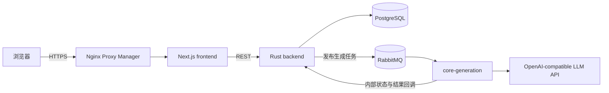

# 智映通学核心学习链路

本仓库是智映通学的单仓库部署版本，当前只维护并上线下面四个真实生成能力：

```text
课前测试
→ 个性化学习计划
→ 每个任务的深度解析与知识导图
→ 每个任务的课后小测
```

四个能力均由 `core-generation` 调用 OpenAI-compatible LLM API 生成。仓库不包含离线生成替代服务，也不存在真实/替代双 profile。

目标远端仓库：[`wcxxx57/Software-Engineering`](https://github.com/wcxxx57/Software-Engineering)

## 1. 目录

| 目录 | 作用 | 技术栈 |
|---|---|---|
| `frontend/` | 注册登录、课前测试、学习计划、任务深度解析、知识导图、课后小测 | Next.js 16、React 19、TypeScript |
| `backend/` | REST API、JWT、学习状态机、数据库、RabbitMQ 发布与内部回调 | Rust、Axum、SeaORM |
| `core-generation/` | 四个真实 LLM 消费者 | Python 3.13、aio-pika、httpx、Pydantic |
| `infra/` | 可选的本地中间件编排 | PostgreSQL、RabbitMQ、MinIO |
| `scripts/` | 服务器发布脚本 | Bash、Docker Compose |

部署与验收步骤见 [`CORE_FLOW_DEPLOYMENT.md`](./CORE_FLOW_DEPLOYMENT.md)，生产架构和排障见 [`DEPLOYMENT_AND_ARCHITECTURE.md`](./DEPLOYMENT_AND_ARCHITECTURE.md)，后续增加其他真实生成服务的边界见 [`MICROSERVICE_EXTENSION.md`](./MICROSERVICE_EXTENSION.md)。

## 2. 架构



`core-generation` 在一个容器中运行四个独立 RabbitMQ 消费者：

| 消费者 | Exchange | Queue |
|---|---|---|
| `pretest` | `zhiying.pretest` | `zhiying.pretest.generate` |
| `plan` | `zhiying.plan` | `zhiying.plan.generate` |
| `knowledge_explanation` | `zhiying.knowledge_explanation` | `zhiying.knowledge_explanation.generate` |
| `quiz` | `zhiying.quiz` | `zhiying.quiz.generate` |

## 3. 本地 Docker 启动

要求：

- Docker Desktop 或 Docker Engine；
- Docker Compose v2；
- 可访问的 OpenAI-compatible Chat Completions API。

复制配置：

```powershell
Copy-Item .env.example .env
```

填写 `.env` 中的数据库密码、RabbitMQ 密码、JWT、四个回调 Key，以及：

```dotenv
LLM_BASE_URL=https://provider.example/v1
LLM_API_KEY=...
LLM_MODEL=...
```

启动唯一的真实版本：

```powershell
docker compose --env-file .env -f compose.yaml -f compose.local.yaml config --quiet
docker compose --env-file .env -f compose.yaml -f compose.local.yaml up -d --build
docker compose --env-file .env -f compose.yaml -f compose.local.yaml ps
```

本地入口：

| 服务 | 地址 |
|---|---|
| 前端 | `http://127.0.0.1:3000` |
| 后端健康检查 | `http://127.0.0.1:9000/health` |
| RabbitMQ 管理台 | `http://127.0.0.1:15672` |
| NPM 管理台 | `http://127.0.0.1:81` |

查看核心日志：

```powershell
docker compose --env-file .env -f compose.yaml -f compose.local.yaml logs -f --tail 200 backend core-generation frontend
```

停止但保留数据库和证书：

```powershell
docker compose --env-file .env -f compose.yaml -f compose.local.yaml down
```

禁止使用 `down -v`，否则可能删除 PostgreSQL、RabbitMQ、NPM 配置和 HTTPS 证书卷。

## 4. 生产镜像和部署

合并到 `main` 后，[`.github/workflows/publish-images.yml`](./.github/workflows/publish-images.yml) 发布：

```text
ghcr.io/wcxxx57/software-engineering-backend
ghcr.io/wcxxx57/software-engineering-frontend
ghcr.io/wcxxx57/software-engineering-core-generation
```

服务器部署目录默认为 `/opt/zhiying`：

```bash
cd /opt/zhiying
git pull --ff-only
chmod 750 scripts/deploy.sh
./scripts/deploy.sh sha-<commit>
```

若使用 `latest`：

```bash
./scripts/deploy.sh latest
```

生产脚本会校验 Compose、拉取三个业务镜像并执行 `up -d --remove-orphans`，不会删除数据卷。

## 5. 提交前校验

```powershell
# Compose
docker compose --env-file .env -f compose.yaml -f compose.local.yaml config --quiet

# 真实生成服务
docker compose --env-file .env -f compose.yaml -f compose.local.yaml build core-generation

# 后端与前端生产镜像
docker compose --env-file .env -f compose.yaml -f compose.local.yaml build backend frontend

# 运行状态
docker compose --env-file .env -f compose.yaml -f compose.local.yaml up -d
docker compose --env-file .env -f compose.yaml -f compose.local.yaml ps
```

生产 `.env`、API Key、Token 和服务器凭据不得提交 Git。
