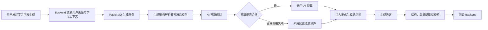

# 学习内容动态化自适应实现说明

## 1. 文档目的

本文说明智映学习系统中以下三项动态化自适应能力的技术实现：

1. 知识视频目标时长动态自适应；
2. 课前小测题目数量动态自适应；
3. 文字讲解篇幅动态自适应。

三项能力遵循同一套核心原则：以当前用户画像、学习上下文和知识点复杂度为输入，由 AI 规划生成预算；所有预算都受确定性上下界约束；AI 规划不可用时使用可配置兜底值；生成结果再经过结构或篇幅校验，避免仅依赖提示词约束。

## 2. 总体架构



动态预算与正式内容生成分成两个步骤，而不是要求一个模型调用同时决定预算和生成内容。这样可以单独校验预算、记录预算来源，并在预算规划失败时安全降级。

## 3. 通用用户画像与学习上下文

### 3.1 用户画像快照

Backend 在投递课前小测、知识视频和文字讲解任务前，通过 `LearnerProfileSnapshot` 生成当前用户画像快照。实现位于：

- `backend/src/services/personalization.rs`

快照字段如下：

| 字段 | 来源 | 用途 |
| --- | --- | --- |
| `age` | 根据 `birth_year` 和当前年份计算 | 辅助判断术语密度、认知负担和示例表达方式 |
| `gender` | 用户资料 | 作为画像信息透传，不作为题数或篇幅的强决策信号 |
| `introduction` | 用户自我介绍 | 提取已有基础、职业或学习目标等自然语言信息 |
| `experience_points` | 用户经验值 | 作为长期活跃度和学习积累的弱信号 |
| `total_checkins` | 累计打卡 | 作为学习持续性的弱信号 |
| `streak_checkins` | 连续打卡 | 作为近期学习投入度的弱信号 |

年龄仅在计算结果位于 `0-150` 的合理区间时进入消息，异常出生年份不会污染 AI 决策。

经验值和打卡数据在规划提示词中被明确规定为“弱信号”。AI 必须结合自我介绍、学习目标、知识点和实际学习进度判断，不能简单地把高经验值等同于高知识水平。

### 3.2 知识视频和文字讲解的学习上下文

从学习任务页生成知识视频或文字讲解时，Backend 还会构造 `LearningContextSnapshot`，包括：

- 学习主题、学习目标和编程语言；
- 总阶段数和已完成阶段数；
- 当前阶段任务总数和已完成任务数；
- 课前测总题数、已答题数和答对题数；
- 当前任务标题和任务描述。

这些字段使视频时长和文字篇幅规划不只依赖静态个人资料，还能感知用户当前掌握程度和学习位置。例如，同一个“动态规划”知识点，对课前测正确率较低、当前阶段刚开始的用户可以选择更长、更细的内容；对课前测表现较好且已完成多数阶段任务的用户则可以选择更短、更聚焦的内容。

独立的文字讲解创建接口没有学习主题和课前测关联，因此只传用户画像和用户输入的知识点提示词；消息模型中的 `learning_context` 为可选字段。

### 3.3 队列兼容性

Python 生成服务中的 `LearnerProfile` 和 `LearningContext` 均提供默认值。旧 RabbitMQ 消息即使不包含新增字段，也可以继续通过 Pydantic 校验并使用兜底画像处理，不需要同步清空队列或一次性升级所有生产者。

## 4. 知识视频目标时长动态自适应

### 4.1 输入与入口

知识视频直接 API 的请求模型位于：

- `services/knowledge2video/src/api/schemas/request.py`

主要输入包括：

- `knowledge_point`：知识点；
- `age`、`gender`、`extra_info`：学习者信息；
- `language`：目标编程语言；
- `difficulty`：难度偏好；
- `duration`：可选人工目标时长。

`duration` 的合法范围为 `5-12` 分钟。直接 API 调用方可以明确指定时长；Backend 的学习任务集成链路默认不指定时长，因此会进入 AI 自适应选择路径。

学习任务集成时，Backend 通过 `KnowledgeVideoGenerateRequest` 发送任务提示词、语言、完整 `learner_profile` 和 `learning_context`。独立 K2V 网站入口也会发送当前用户画像，但没有学习主题关联时不包含 `learning_context`。

`services/knowledge2video/src/integration_payload.py` 负责将结构化画像映射到视频管线：

- 年龄和性别分别映射为 `age`、`gender`；
- 自我介绍、经验值、打卡、学习目标、阶段进度、课前测表现和当前任务被组织成清晰的 `extra_info` 画像文本；
- 经验值和打卡在文本中明确标记为弱信号；
- 原始 `learner_profile` 和 `learning_context` 继续进入视频任务并写入 metadata，便于验收和问题回溯；
- 旧消息只有 `extra_info` 时继续兼容，不要求清空 RabbitMQ 队列。

### 4.2 用户画像解析

知识视频服务先把自然语言画像解析为结构化数据，主要包括：

- 已有知识 `known_concepts`；
- 待补缺口 `knowledge_gaps`；
- 学习目标 `learning_goal`；
- 难度偏好 `difficulty_preference`；
- 易错认知和应避免的超纲术语；
- 大纲深度、动画节奏、代码注释密度等分阶段教学指导。

相关实现位于：

- `services/knowledge2video/prompts/user_profile.py`
- `services/knowledge2video/src/api/tasks/video_tasks.py`

### 4.3 时长决策

时长决策位于：

- `services/knowledge2video/src/pedagogy.py` 的 `select_duration_with_ai`；
- `services/knowledge2video/src/agent.py` 的 `_ensure_duration_resolved`。

决策顺序如下：

1. 如果请求显式提供 `duration`，先校验其是否为 `5-12` 的整数，合法时直接使用，来源记为 `manual`；
2. 如果未提供时长，AI 综合知识点复杂度、已有知识、知识缺口、学习目标和难度偏好，在 `5-12` 分钟内选择整数时长；
3. AI 输出需要是合法 JSON，且时长必须位于上下界内；
4. AI 规划最多尝试 3 次；持续失败时使用 8 分钟兜底，来源记为 `fallback`；
5. AI 成功时来源记为 `ai`。

### 4.4 时长向下游传播与校验

选定时长不是只写入一个提示词，而是贯穿整个视频生成链路：

- 大纲生成必须把各章节预计时长控制在目标时长的 `90%-110%`；
- 分镜生成同样校验预计总时长；
- 旁白生成后以落盘音频的物理时长作为动画同步真值；
- 最终视频使用 `ffprobe` 等工具测量物理成片时长；
- 任务结果记录 `duration`、`duration_source`、`actual_duration_seconds` 和允许时长区间。

这里区分“目标时长”和“物理时长”：AI 只负责规划目标预算，最终音视频时长必须以真实文件测量结果为准，不能使用模型估算或接口元数据冒充成片真值。

## 5. 课前小测题数动态自适应

### 5.1 Backend 消息构造

创建学习主题时，Backend 读取用户记录并将画像快照加入 `PretestRequest`。相关实现位于：

- `backend/src/routes/study_subjects.rs`
- `backend/src/services/study_subject.rs`
- `backend/src/services/personalization.rs`

除原有的知识点、目标、语言和计划阶段数外，RabbitMQ 消息新增：

```json
{
  "learner_profile": {
    "age": 20,
    "gender": "MALE",
    "introduction": "有 C 语言基础，希望系统学习 Rust",
    "experience_points": 120,
    "total_checkins": 18,
    "streak_checkins": 5
  }
}
```

### 5.2 AI 题数规划

规划实现位于：

- `services/core-generation/src/zhiying_core_generation/adaptive.py` 的 `select_pretest_problem_count`。

默认配置为：

- 最少题数：6；
- 最多题数：14；
- AI 规划失败兜底题数：10。

AI 决策规则包括：

- 基础薄弱、目标跨度大、知识点含多个子概念时增加题数；
- 基础较好、学习目标聚焦、知识点单一时减少题数；
- 题目需要覆盖基础概念、辨析和应用能力；
- 不得为了达到上限生成同质重复题；
- 经验值和打卡数据只作为弱信号。

AI 必须返回：

```json
{
  "problem_count": 8,
  "reason": "目标聚焦，但仍需覆盖概念理解和边界应用"
}
```

只有位于配置上下界内的整数才会被接受。规划调用失败、JSON 不合法或题数越界时，系统使用 `PRETEST_PROBLEM_COUNT` 兜底值，并把来源记为 `fallback`。

### 5.3 正式出题与强校验

正式出题位于：

- `services/core-generation/src/zhiying_core_generation/generators.py` 的 `generate_pretest`。

AI 规划出的题数会同时写入：

1. 正式出题提示词；
2. “必须恰好生成 N 道”的显式约束；
3. 生成结果的确定性数量校验。

如果模型返回的题数与动态预算不一致，生成任务不会把不完整结果当作成功结果回调。每道题仍继续经过原有 Pydantic 校验，包括四个选项互不相同、答案只能为 A/B/C/D、题干和解析非空等约束。

成功结果附带以下自适应元数据：

```json
{
  "adaptation": {
    "problem_count": 8,
    "source": "ai",
    "reason": "目标聚焦，但仍需覆盖概念理解和边界应用"
  }
}
```

Backend 当前回调模型会忽略未使用的扩展字段，因此该元数据不会破坏现有回调兼容性；如需长期审计，可在后续数据库迁移中增加题数决策和来源字段。

## 6. 文字讲解篇幅动态自适应

### 6.1 Backend 消息构造

文字讲解有两个入口：

1. 独立接口 `POST /api/v1/knowledge-explanations`；
2. 学习任务接口 `POST /api/v1/study-tasks/{id}/explanation`。

独立接口发送知识点提示词和用户画像；学习任务接口额外发送学习主题、目标、语言、阶段进度、任务进度和课前测表现。

相关实现位于：

- `backend/src/routes/knowledge_explanations.rs`
- `backend/src/routes/study_tasks.rs`
- `backend/src/services/personalization.rs`

重试失败任务时会重新读取当前用户记录并生成新的画像快照，因此用户在首次生成后更新个人介绍或经验值时，重试可以使用最新画像，而不是复用旧快照。

### 6.2 AI 篇幅规划

规划实现位于：

- `services/core-generation/src/zhiying_core_generation/adaptive.py` 的 `select_explanation_length`。

默认配置为：

- 最少目标字符数：1200；
- 最多目标字符数：4800；
- AI 规划失败兜底字符数：2600；
- 默认兜底深度：`standard`。

AI 同时选择：

- `target_chars`：Markdown 正文目标字符数；
- `detail_level`：`concise`、`standard` 或 `deep`；
- `reason`：一句中文决策理由。

决策规则包括：

- 基础薄弱、知识点抽象、前置概念多、需要推导或代码追踪时增加篇幅；
- 基础较好、学习进度靠后、任务单一明确时缩短篇幅；
- 不能通过重复表述、无关背景或冗余示例填充目标字数；
- 课前测正确率和当前阶段进度优先作为实际掌握度信号；
- 经验值和打卡数据只作为弱信号。

AI 规划失败或返回越界值时使用配置兜底预算，来源记为 `fallback`；合法规划来源记为 `ai`。

### 6.3 正式生成和篇幅反馈重试

正式生成仍要求 Markdown 至少覆盖：概述、核心概念、逐步讲解、示例、常见错误、实践建议和小结，但每一部分的解释密度由动态预算和 `detail_level` 决定。

目标字符数使用 `±15%` 的接受区间。例如，目标为 2600 字时，接受范围约为 2210 至 2990 字。

生成流程如下：

1. 按动态目标字数和深度生成完整 Markdown；
2. 使用 Python `len(content)` 计算实际字符数；
3. 如果落在 `±15%` 区间内，立即接受；
4. 如果偏短或偏长，把上一次实际字数和目标区间反馈给模型，要求保留知识完整性并重新组织篇幅；
5. 默认最多生成 2 次；
6. 如果所有候选都未进入区间，选择与目标字数距离最近的完整候选，避免因轻微篇幅偏差导致整个任务失败。

成功结果附带：

```json
{
  "adaptation": {
    "target_chars": 3600,
    "detail_level": "deep",
    "source": "ai",
    "reason": "需要补足状态定义和状态转移推导",
    "actual_chars": 3488
  }
}
```

## 7. 配置项

核心生成服务新增或复用以下环境变量：

| 环境变量 | 默认值 | 说明 |
| --- | ---: | --- |
| `PRETEST_PROBLEM_COUNT_MIN` | 6 | 课前小测最少题数 |
| `PRETEST_PROBLEM_COUNT_MAX` | 14 | 课前小测最多题数 |
| `PRETEST_PROBLEM_COUNT` | 10 | 题数规划失败时的兜底值 |
| `EXPLANATION_TARGET_CHARS_MIN` | 1200 | 文字讲解最少目标字符数 |
| `EXPLANATION_TARGET_CHARS_MAX` | 4800 | 文字讲解最多目标字符数 |
| `EXPLANATION_TARGET_CHARS` | 2600 | 篇幅规划失败时的兜底值 |
| `EXPLANATION_LENGTH_MAX_ATTEMPTS` | 2 | 文字讲解为满足篇幅范围允许的最大生成次数 |

配置由 Pydantic 启动校验保证：

- 所有数值必须为正整数；
- 兜底题数必须位于题数最小值和最大值之间；
- 兜底字符数必须位于字符数最小值和最大值之间。

配置示例已同步到：

- `.env.example`
- `services/core-generation/.env.example`
- `compose.yaml`

## 8. 失败降级与稳定性设计

| 环节 | 失败情况 | 处理方式 |
| --- | --- | --- |
| 用户年龄计算 | 出生年份异常 | 忽略年龄，不阻断任务 |
| AI 题数规划 | API、JSON、Schema 或边界校验失败 | 使用固定兜底题数 |
| 正式出题 | 返回题数与预算不一致 | 任务失败，不写入部分题目 |
| AI 篇幅规划 | API、JSON、Schema 或边界校验失败 | 使用固定兜底字符数和 `standard` 深度 |
| 文字讲解首次篇幅偏差 | 实际字符数超出 ±15% | 带实际字数反馈重新生成 |
| 多次讲解仍偏离目标 | 未进入接受区间 | 采用最接近目标的完整候选 |
| 旧队列消息无画像 | 新字段缺失 | 使用 Pydantic 默认画像和空上下文 |
| 视频 AI 时长规划失败 | 多次输出无效 | 使用 8 分钟兜底 |

## 9. 隐私与决策约束

- 只发送生成所需的画像字段，不发送用户名、密码、金币、钻石、登录时间等无关或敏感数据；
- 性别仅作为画像透传字段，不应直接决定题数、篇幅或难度；
- 经验值和打卡不能被当作知识掌握度的强替代指标；
- 对文字讲解，课前测表现和当前学习进度比经验值更能反映当前掌握程度；
- AI 决策只能在后端配置的数值边界内生效，不能自行扩大资源消耗上限。

## 10. 测试与验证

核心生成服务新增 `services/core-generation/tests/test_adaptive.py`，覆盖：

- AI 选择的课前测题数被正式出题流程采用；
- 题数规划调用失败时使用配置兜底值；
- 合法的文字讲解目标字数和深度能够通过边界校验；
- 首次文字讲解篇幅偏离目标时会反馈实际字数并重试；
- 重试后结果进入目标范围并记录实际字符数。

Backend 测试断言增加了课前测、知识视频和独立文字讲解消息中的用户画像字段。Knowledge2Video 新增 Bridge 映射测试，验证年龄、性别、自我介绍、经验值、打卡、学习进度和课前测表现都进入视频画像文本与结构化 metadata。

本次实现验证结果：

- Core Generation Ruff 格式检查通过；
- Core Generation Ruff 静态检查通过；
- Core Generation 7 项测试全部通过；
- Backend Docker release 构建通过。
- Knowledge2Video 23 项容器回归测试通过。

当前 Backend 集成测试套件还受到仓库内既有存储重构未同步测试夹具的影响：测试代码仍引用已经变更的内容实体字段，并缺少新配置字段。这些编译错误与本次自适应实现无关，因此本次以 Backend 完整 release 构建和 Core Generation 自动化测试作为主要验证依据。

## 11. 后续演进建议

1. 在数据库中持久化 `adaptation` 决策，包括预算值、来源、理由和实际结果，以支持运营分析和 A/B 测试；
2. 收集小测完成率、平均耗时和区分度，使用真实学习效果校准 `6-14` 的题数范围；
3. 收集文字讲解阅读完成率、停留时长和后测提升，校准字符数范围和 `±15%` 容差；
4. 将用户对“太长、太短、太难、太浅”的显式反馈加入下一次预算规划；
5. 对预算规划结果增加模型版本和提示词版本，便于回溯不同版本的自适应行为；
6. 对视频、题数和文字篇幅建立统一的自适应决策表或事件流，形成跨内容形态的一致可观测性。
