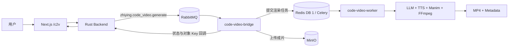

# Code2Video 接入技术说明

## 1. 接入目标

本次迭代将独立的 Code2Video 编程题讲解视频生成能力接入智映通学单仓库，实现从前端提交题目和标准答案代码，到后台生成、对象存储、状态回调和网页播放的完整闭环。

接入后同时保留两种调用方式：

- 平台调用：用户通过 `/c2v` 页面提交任务，由 Rust Backend、RabbitMQ 和生成服务协同完成；
- 原生调用：保留 Code2Video FastAPI、SSE 进度流、任务查询和文件下载接口，便于独立调试。

## 2. 总体架构



核心调用链：

```text
题目描述 + 标准答案代码
→ Backend 创建 code_video 记录
→ RabbitMQ 发布任务
→ Bridge 拆分并校验权威输入
→ Celery Worker 生成讲解视频
→ Bridge 上传 MinIO
→ Backend 更新 FINISHED / FAILED
→ 前端播放器加载视频
```

## 3. 服务组成

Code2Video 源码位于 `services/code2video/`，在根级 Compose 中拆分为三个运行单元：

| 服务 | 职责 |
|---|---|
| `code-video-api` | 提供原生 FastAPI、Swagger、SSE、任务查询和文件下载能力 |
| `code-video-worker` | 执行 LLM 规划、TTS、Manim 渲染、FFmpeg 合并等长任务 |
| `code-video-bridge` | 消费平台 RabbitMQ 任务，提交 Celery、上传 MinIO并回调 Backend |

本地入口：

| 功能 | 地址 |
|---|---|
| 前端 Code2Video 页面 | `http://127.0.0.1:3080/c2v` |
| Code2Video Swagger | `http://127.0.0.1:8081/docs` |
| Code2Video 健康检查 | `http://127.0.0.1:8081/health` |

## 4. 输入契约

前端分别采集题目描述与标准答案代码，并组合为平台 `prompt`：

````markdown
# 题目
给定一个有序数组，查找目标值的位置。

# 核心代码
```python
def search(nums, target):
    ...
```
````

Bridge 会将其转换为 Code2Video 原生请求：

```json
{
  "problem_description": "给定一个有序数组，查找目标值的位置。",
  "solution_code": "def search(nums, target):\n    ...",
  "language": "Python",
  "render_profile": "1080p30",
  "difficulty": "medium"
}
```

接入层遵循以下约束：

- `problem_description` 和 `solution_code` 是权威输入；
- 标准答案代码只做结构拆分，不被静默改写；
- 缺少题目或代码块时直接拒绝任务；
- 支持从代码围栏或代码内容识别 Python、C++、Java、Go、Rust、JavaScript 等语言。

## 5. 平台状态流转

CodeVideo 资源沿用 Backend 已有状态机：

```text
QUEUING → GENERATING → FINISHED
                     ↘ FAILED
```

Bridge 使用内部接口回调状态：

```http
PATCH /internal/code-videos/{id}
Authorization: Bearer {CODE_VIDEO_API_KEY}
```

完成回调示例：

```json
{
  "status": "FINISHED",
  "object_key": "code-videos/42-uuid.mp4"
}
```

失败时回调 `FAILED`，Backend 使用已有业务逻辑退还本次生成消耗的钻石。

## 6. 队列与资源隔离

Code2Video 和 Knowledge2Video 都使用 Celery 和媒体渲染工具链，但两者的输入契约及生成逻辑不同。本次接入通过独立队列、Redis DB 和输出卷避免任务串消费和资源污染。

| 隔离项 | Knowledge2Video | Code2Video |
|---|---|---|
| RabbitMQ Queue | `zhiying.knowledge_video.generate` | `zhiying.code_video.generate` |
| Celery Queue | `video_generation` | `code_video_generation` |
| Redis | DB 0 | DB 1 |
| 输出卷 | `knowledge-video-output` | `code-video-output` |
| MinIO 前缀 | `knowledge-videos/` | `code-videos/` |

Bridge 使用稳定 Celery Task ID 和 Redis 锁实现任务恢复与防重复提交：

```text
zhiying-code-video-{task_id}
zhiying:code-video:submitted:{task_id}
```

## 7. 关键配置

`.env` 至少需要配置：

```dotenv
# Backend 与 Bridge 回调认证，必须保持一致
CODE_VIDEO_API_KEY=sk-change-code-video

# 原生 Code2Video API 认证
CODE_VIDEO_SERVICE_API_KEY=replace-with-random-api-key

# LLM 与渲染参数
CODE_VIDEO_LOGIC_MODEL=gpt-5.6-terra
CODE_VIDEO_CODE_MODEL=gpt-5.6-sol
CODE_VIDEO_DEFAULT_API=gpt-5
CODE_VIDEO_RENDER_PROFILE=1080p30
CODE_VIDEO_RENDER_WORKERS=1

# 与知识视频共用的 TTS 配置
VIVO_TTS_APP_ID=replace-me
VIVO_TTS_APP_KEY=replace-me
```

Code2Video 同时复用项目级 `LLM_BASE_URL`、`LLM_API_KEY`、RabbitMQ、Redis 和 MinIO 配置。

## 8. Docker 构建优化

Code2Video 镜像包含 FFmpeg、Cairo、Pango、中文字体、TeX Live、Manim、OpenCV 和科学计算依赖，正式镜像约 `3.84 GB`。

本次迭代对原 Dockerfile 做了以下优化：

- 使用 Python 3.13，与当前生成服务运行时保持一致；
- 使用可用的 Debian 镜像源并增加安装重试；
- 移除体积过大的非必要 `texlive-fonts-extra`；
- 保留 LaTeX、科学公式和 `dvisvgm` 所需组件；
- 构建时强制检查 `latex`、`pdflatex`、`dvisvgm`、FFmpeg、Cairo、Pango 和中文字体；
- 清理 APT、pip 和历史 BuildKit 中间缓存，避免构建空间持续膨胀。

## 9. 验证结果

本次接入已完成以下验证：

| 验证项 | 结果 |
|---|---|
| Code2Video 正式镜像构建 | 通过 |
| FastAPI 健康检查 | `status=ok` |
| Redis DB 1 连接 | 通过 |
| Celery Worker 启动 | `ready` |
| RabbitMQ CodeVideo 消费者 | `1` 个 |
| API 参数校验 | 空请求返回 `422` |
| 容器内全量测试 | `21 passed` |
| 中文字体渲染 | 通过 |
| MathTex / LaTeX / dvisvgm | 通过 |
| FFmpeg H.264 输出 | 通过 |
| 前端 `/c2v` 路由 | 正常跳转登录页 |

媒体冒烟测试实际生成了：

```text
H.264 / 320×180 / 15 FPS / 0.2 秒
```

说明裁剪 Docker 依赖后，中文文本、数学公式、Manim 和 FFmpeg 物理渲染链路仍然完整。
