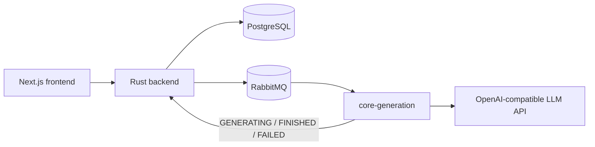

# 核心学习链路：本地测试与单仓库部署

本文档只覆盖当前敏捷测试范围：

```text
创建学习主题
→ 真实课前测试生成
→ 提交课前测试
→ 真实个性化计划生成
→ 进入学习任务
→ 真实深度解析与知识导图
→ 真实课后小测生成与提交
```

在 `CORE_FLOW_ONLY=true` 时，每个学习任务仍会自动生成文字深度解析和思维导图；视频与互动 HTML 不自动创建，也不在学习任务页显示。

启用该能力之前已经存在的历史任务可能没有 `knowledge_explanation_id`。任务页会显示“生成深度解析”按钮，通过 `POST /api/v1/study-tasks/{id}/explanation` 补建解析记录；新计划中的任务仍由后端自动创建并投递，无需手动点击。

## 1. 服务关系



`core-generation` 同时运行四个消费者，但它们使用独立队列：

| 能力 | Exchange | Queue | 回调 |
|---|---|---|---|
| 课前测试 | `zhiying.pretest` | `zhiying.pretest.generate` | `POST /internal/study-subjects/{task_id}` |
| 个性化计划 | `zhiying.plan` | `zhiying.plan.generate` | `POST /internal/study-subjects/{task_id}` |
| 课后小测 | `zhiying.quiz` | `zhiying.quiz.generate` | `POST /internal/study-quizzes/{task_id}` |
| 深度解析 | `zhiying.knowledge_explanation` | `zhiying.knowledge_explanation.generate` | `PATCH /internal/knowledge-explanations/{task_id}` |

## 2. 模型配置

从模板创建本地配置：

```powershell
Copy-Item .env.example .env
```

至少修改：

```dotenv
PUBLIC_HOST=localhost
POSTGRES_PASSWORD=<本地密码>
RABBITMQ_PASSWORD=<本地密码>
JWT_SECRET=<随机长字符串>
CORE_FLOW_ONLY=true

LLM_BASE_URL=<OpenAI兼容接口的v1地址>
LLM_API_KEY=<只写入.env，不提交Git>
LLM_MODEL=<模型名称>
```

常见示例：

```dotenv
# DeepSeek
LLM_BASE_URL=https://api.deepseek.com/v1
LLM_MODEL=deepseek-chat

# OpenAI
LLM_BASE_URL=https://api.openai.com/v1
LLM_MODEL=gpt-4.1-mini

# 通义千问 OpenAI 兼容模式
LLM_BASE_URL=https://dashscope.aliyuncs.com/compatible-mode/v1
LLM_MODEL=qwen-plus
```

四个回调 Key 必须与 backend 使用相同值：

```dotenv
PRETEST_API_KEY=sk-...
PLAN_API_KEY=sk-...
QUIZ_API_KEY=sk-...
KNOWLEDGE_EXPLANATION_API_KEY=sk-...
```

## 3. 本地测试

本地机器安装 Docker Desktop 后，在仓库根目录执行：

```powershell
docker compose --env-file .env -f compose.yaml -f compose.local.yaml config --quiet
docker compose --env-file .env -f compose.yaml -f compose.local.yaml up -d --build
docker compose --env-file .env -f compose.yaml -f compose.local.yaml ps
```

查看核心服务日志：

```powershell
docker compose --env-file .env -f compose.yaml -f compose.local.yaml logs -f --tail 200 backend core-generation frontend
```

当前仓库只提供真实生成版本，缺少有效模型 API Key 时 `core-generation` 会启动失败，不会回退到固定内容。

建议的端到端验收步骤：

1. 注册并登录；
2. 创建学习主题；
3. 确认主题状态依次变为 `PRETEST_GENERATING`、`PRETEST_READY`；
4. 完成所有课前题并提交；
5. 确认状态依次变为 `PLAN_GENERATING`、`STUDYING`；
6. 打开第一个学习任务；
7. 创建课后小测，确认状态变为 `GENERATING`、`READY`；
8. 回答并提交，确认状态为 `SUBMITTED` 且分数正确；
9. 确认每个任务的深度解析生成完成，并且没有视频/互动内容生成入口。

## 4. GitHub 镜像发布

合并到 `main` 后，`.github/workflows/publish-images.yml` 会构建并发布：

```text
ghcr.io/wcxxx57/software-engineering-backend
ghcr.io/wcxxx57/software-engineering-frontend
ghcr.io/wcxxx57/software-engineering-core-generation
```

每个镜像同时生成 `latest` 和 `sha-<commit>` 标签。生产环境推荐固定 `sha-<commit>`，便于回滚。

若 GHCR Package 保持私有，服务器需要一个仅含 `read:packages` 的 GitHub Token，并通过标准输入登录：

```bash
echo "$GHCR_TOKEN" | docker login ghcr.io -u wcxxx57 --password-stdin
```

## 5. 从旧跨仓库部署迁移到单仓库

迁移时保留原 `/opt/zhiying/.env` 和所有 Docker named volumes。不要执行 `docker compose down -v`。

推荐先在服务器备份：

```bash
cd /opt/zhiying
cp .env /root/zhiying.env.backup
docker volume ls | grep zhiying
```

然后把部署目录切换为当前仓库。若旧目录本身是其他 Git 仓库，建议先改名保留：

```bash
cd /opt
mv zhiying zhiying-legacy
git clone https://github.com/wcxxx57/Software-Engineering.git zhiying
cp /root/zhiying.env.backup /opt/zhiying/.env
chmod 600 /opt/zhiying/.env
```

因为根 Compose 明确使用 `name: zhiying`，新的 Compose 会继续识别原来的：

- `zhiying_postgres-data`；
- `zhiying_rabbitmq-data`；
- `zhiying_npm-data`；
- `zhiying_npm-letsencrypt`。

部署：

```bash
cd /opt/zhiying
chmod 750 scripts/deploy.sh
./scripts/deploy.sh latest
```

固定到某个 Git SHA：

```bash
./scripts/deploy.sh sha-abcdef0
```

部署后检查：

```bash
docker compose --env-file .env -f compose.yaml -f compose.prod.yaml ps
docker compose --env-file .env -f compose.yaml -f compose.prod.yaml logs --tail 200 core-generation
curl -I https://zhiying.ecnu.top
```

NPM、Proxy Host 和 Let’s Encrypt 证书保存在原 named volumes 中，正常情况下不需要重新申请证书。

## 6. 后续迭代

日常流程：

```text
本地开发与测试
→ push 功能分支
→ Pull Request 合并到 main
→ GitHub Actions 构建三个镜像
→ SSH 登录服务器
→ git pull --ff-only
→ ./scripts/deploy.sh sha-<commit>
```

数据库结构变化前必须先备份 PostgreSQL。正式环境禁止执行：

```bash
docker compose down -v
```
