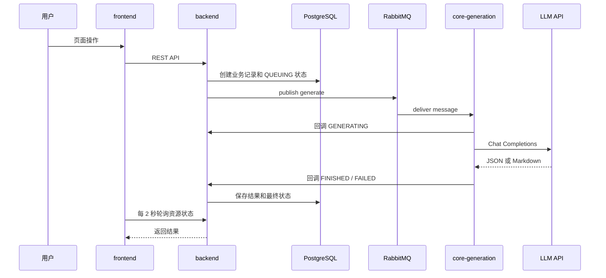

# 部署与架构说明

本文档描述当前唯一上线版本。生成链路只包含四个真实 LLM 消费者：`pretest`、`plan`、`knowledge_explanation`、`quiz`。

## 1. 生产服务

| Compose service | 容器 | 职责 |
|---|---|---|
| `npm` | `zhiying-npm` | 80/443 入口、反向代理、Let's Encrypt |
| `frontend` | `zhiying-frontend` | Next.js Web 应用 |
| `backend` | `zhiying-backend` | REST API、鉴权、数据库与任务发布 |
| `core-generation` | `zhiying-core-generation` | 四个真实 LLM RabbitMQ 消费者 |
| `postgres` | `zhiying-postgres` | 业务数据与生成状态 |
| `rabbitmq` | `zhiying-rabbitmq` | 异步任务队列 |

业务镜像：

```text
ghcr.io/wcxxx57/software-engineering-frontend
ghcr.io/wcxxx57/software-engineering-backend
ghcr.io/wcxxx57/software-engineering-core-generation
```

## 2. 请求与生成链路



四个消费者契约：

| 能力 | Exchange | Queue | Backend callback |
|---|---|---|---|
| 课前测试 | `zhiying.pretest` | `zhiying.pretest.generate` | `POST /internal/study-subjects/{id}` |
| 个性化计划 | `zhiying.plan` | `zhiying.plan.generate` | `POST /internal/study-subjects/{id}` |
| 深度解析 | `zhiying.knowledge_explanation` | `zhiying.knowledge_explanation.generate` | `PATCH /internal/knowledge-explanations/{id}` |
| 课后小测 | `zhiying.quiz` | `zhiying.quiz.generate` | `POST /internal/study-quizzes/{id}` |

Exchange 和 queue 均为 durable，routing key 为 `generate`。每个回调使用独立 `sk-` API Key。

## 3. 配置边界

根目录 `.env` 是本地和服务器的唯一敏感配置文件，必须包含：

- `PUBLIC_HOST`；
- PostgreSQL 和 RabbitMQ 账号密码；
- `JWT_SECRET`；
- `LLM_BASE_URL`、`LLM_API_KEY`、`LLM_MODEL`；
- `PRETEST_API_KEY`；
- `PLAN_API_KEY`；
- `KNOWLEDGE_EXPLANATION_API_KEY`；
- `QUIZ_API_KEY`。

`LLM_BASE_URL` 必须指向兼容 API 的版本化路径，通常以 `/v1` 结尾。首页地址或控制台地址即使返回 HTTP 200，也不是 Chat Completions API。

四个回调 Key 在 `backend` 和 `core-generation` 中必须完全一致。它们只用于 Docker 内部 HTTP 回调，不应发送给浏览器。

`CORE_FLOW_ONLY=true` 时：

- 课前测试、计划、深度解析、课后小测正常开放；
- 知识视频、代码视频和互动 HTML 不在任务页展示；
- 对应生成接口在 backend 返回 `FEATURE_DISABLED`；
- 计划和课后小测不会等待这些关闭能力。

## 4. 网络与端口

生产公网只开放：

| 端口 | 用途 |
|---:|---|
| 22 | SSH，建议限制来源 IP |
| 80 | HTTP 与证书验证 |
| 443 | HTTPS |

不要公网开放 PostgreSQL、RabbitMQ、backend、frontend、core-generation 健康端口或 NPM 81 管理端口。

NPM 管理台通过 SSH 隧道访问：

```bash
ssh -N -L 8181:127.0.0.1:81 root@your-server
```

浏览器打开 `http://127.0.0.1:8181`，Proxy Host 指向：

```text
Scheme: http
Forward Hostname: frontend
Forward Port: 3000
```

## 5. 数据卷

Compose project name 固定为 `zhiying`，持久化卷为：

```text
zhiying_postgres-data
zhiying_rabbitmq-data
zhiying_npm-data
zhiying_npm-letsencrypt
```

更新业务镜像不会删除这些卷。禁止执行：

```bash
docker compose down -v
```

数据库结构变更前应先执行 PostgreSQL 备份，并把备份复制到服务器以外的位置。

## 6. GitHub Actions

`.github/workflows/publish-images.yml` 在以下事件构建三个业务镜像：

- push 到 `main`；
- push `v*` tag；
- 手动 `workflow_dispatch`。

镜像标签：

- 默认分支产生 `latest`；
- 每个提交产生 `sha-<short-commit>`；
- Git tag 产生对应版本标签。

生产部署推荐使用不可变的 `sha-<commit>`，便于精确回滚。

## 7. 首次部署

```bash
mkdir -p /opt
cd /opt
git clone https://github.com/wcxxx57/Software-Engineering.git zhiying
cd /opt/zhiying
cp .env.example .env
chmod 600 .env
```

填写 `.env` 后，如果 GHCR Package 是私有的，使用仅含 `read:packages` 的 Token 登录：

```bash
echo "$GHCR_TOKEN" | docker login ghcr.io -u wcxxx57 --password-stdin
```

部署：

```bash
chmod 750 scripts/deploy.sh
./scripts/deploy.sh sha-<commit>
```

验证：

```bash
docker compose --env-file .env -f compose.yaml -f compose.prod.yaml ps
docker compose --env-file .env -f compose.yaml -f compose.prod.yaml logs --tail 200 core-generation
curl -I https://your-domain.example
```

## 8. 日常更新与回滚

```bash
cd /opt/zhiying
git pull --ff-only
./scripts/deploy.sh sha-<new-commit>
```

回滚只需部署上一版镜像标签：

```bash
./scripts/deploy.sh sha-<previous-commit>
```

如果后端版本包含数据库 migration，回滚前必须确认旧程序是否兼容已经升级的 schema。

## 9. 排障顺序

```bash
docker compose --env-file .env -f compose.yaml -f compose.prod.yaml ps
docker compose --env-file .env -f compose.yaml -f compose.prod.yaml logs --tail 200 rabbitmq
docker compose --env-file .env -f compose.yaml -f compose.prod.yaml logs --tail 200 backend
docker compose --env-file .env -f compose.yaml -f compose.prod.yaml logs --tail 200 core-generation
docker compose --env-file .env -f compose.yaml -f compose.prod.yaml logs --tail 200 frontend
```

常见判断：

- 长时间 `QUEUING`：检查 `core-generation` 是否运行、queue 是否有 consumer；
- 长时间 `GENERATING`：检查 LLM API 网络、模型名、超时和限流；
- 回调 401：检查对应 Key 在 backend 与 core-generation 是否一致；
- LLM 返回 HTML：检查 `LLM_BASE_URL` 是否确实是 `/v1` API 地址；
- 容器 `Exited (137)`：检查宿主机 OOM，低内存服务器应增加内存或 Swap；
- NPM 502：检查目标必须是 `frontend:3000`，不能使用容器内的 `localhost`。
