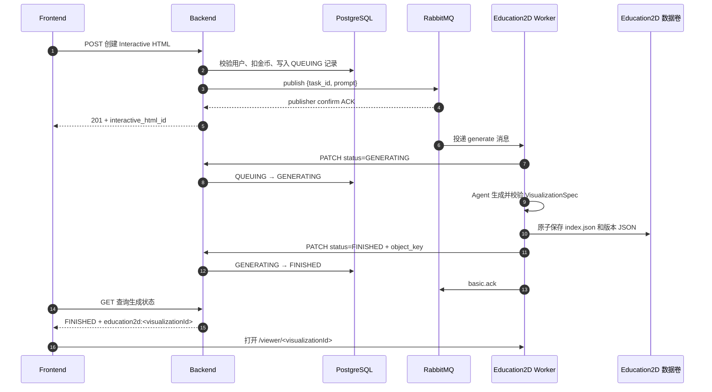
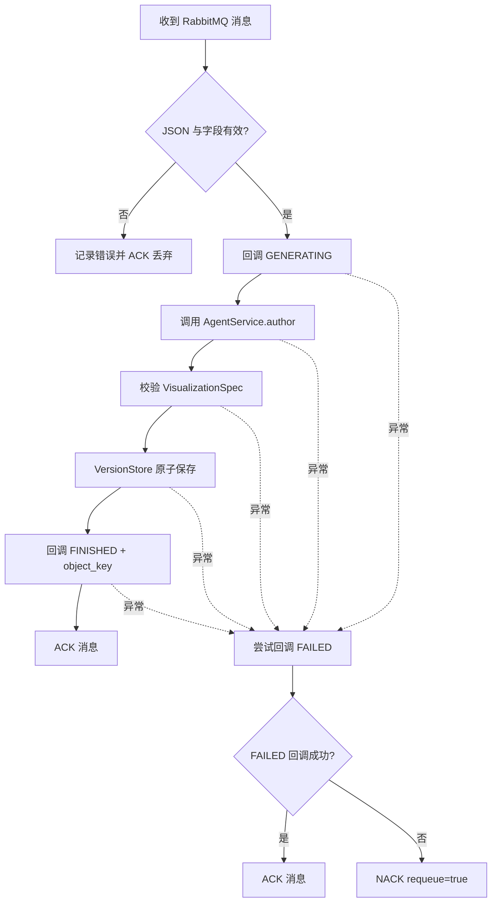
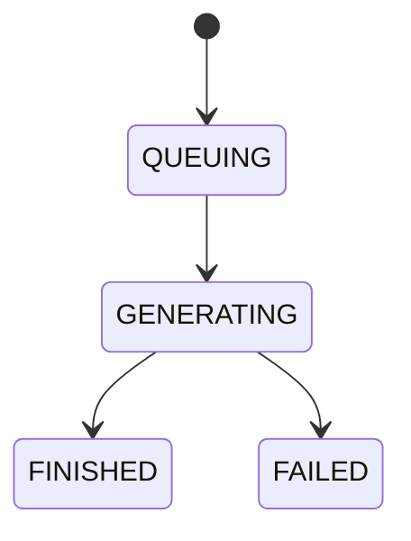

# Education2D 平台 RabbitMQ 接入文档

> 本文面向项目介绍、技术演示和接入联调人员，说明 Education2D 如何通过 RabbitMQ 接入智映通学平台。
>
> 适用代码：`backend`、`services/education2d`、根目录 `compose.yaml`。

## 演示摘要

Education2D 的接入采用“Backend 创建任务、RabbitMQ 异步派发、Worker 独立生成、HTTP 回调状态、持久化目录保存结果”的方式。用户提交二维教学可视化需求后，Backend 先完成鉴权、扣费和任务落库，再把精简的 JSON 消息发送到 RabbitMQ。Education2D Worker 消费消息并调用 Agent 生成结构化可视化，完成后把结果引用回调给 Backend，前端即可通过 Viewer 展示生成内容。

这套接入方式使生成任务与用户请求解耦：耗时的 Agent 生成不会阻塞 Backend 请求线程，Worker 可以独立部署和扩容，任务状态、费用与结果引用仍由平台统一管理。

## 1. 接入目标与职责边界

Education2D 用于异步生成二维交互教学可视化。整条链路采用：

- Backend 负责鉴权、扣费、创建业务记录、派发任务和保存最终业务状态；
- RabbitMQ 负责把生成命令可靠地从 Backend 传递给 Worker；
- Education2D Worker 负责消费消息、调用 Agent 生成可视化、保存版本文件；
- Worker 通过 HTTP 回调 Backend，报告 `GENERATING`、`FINISHED` 或 `FAILED`；
- Backend 的 PostgreSQL 保存状态和结果引用，Education2D 数据卷保存实际可视化 Spec 与版本历史；
- Frontend 根据 Backend 返回的 `object_key` 打开 Education2D Viewer。

RabbitMQ 不是任务状态数据库，也不保存最终生成结果。任务的权威业务状态在 Backend 数据库中，生成结果本体在 Education2D 的持久化数据目录中。



## 2. RabbitMQ 拓扑

当前 Education2D 使用独立的 direct exchange 和独立队列：

| 项目 | 当前值 |
|---|---|
| Exchange | `zhiying.interactive_html` |
| Exchange 类型 | `direct` |
| Queue | `zhiying.interactive_html.generate` |
| Routing Key | `generate` |
| Exchange durable | `true` |
| Queue durable | `true` |
| 消息持久化 | `delivery_mode = 2` |
| Content-Type | `application/json` |
| Consumer ACK | 手动 `ack/nack` |
| 默认 prefetch | `1` |

Backend 启动时统一声明 exchange、queue 和 binding；Education2D Worker 启动时也使用相同参数执行幂等声明。两边的 exchange 类型、名称及 durable 参数必须完全一致，否则 RabbitMQ 会关闭发生声明冲突的 channel。

Backend 发布时启用 publisher confirms。只有 Broker 返回 ACK，Backend 才认为任务成功入队；连接失败、发布失败、confirm 失败或 Broker NACK 都会按“派发失败”处理。

### 2.1 配置项

Backend：

```dotenv
RABBITMQ_URL=amqp://<user>:<password>@rabbitmq:5672/%2f
INTERACTIVE_HTML_EXCHANGE=zhiying.interactive_html
INTERACTIVE_HTML_API_KEY=sk-<共享密钥>
INTERACTIVE_HTML_GOLD_COST=50
```

Education2D：

```dotenv
RABBITMQ_URL=amqp://<user>:<password>@rabbitmq:5672/%2f
BACKEND_BASE_URL=http://backend:9000
INTERACTIVE_HTML_API_KEY=sk-<与 Backend 完全相同的共享密钥>
WORKER_ENABLED=true
WORKER_PREFETCH=1
DATA_DIR=/data
```

注意：`INTERACTIVE_HTML_API_KEY` 只用于 Worker 到 Backend 的 HTTP 回调，不放进 RabbitMQ 消息。生产环境必须使用随机强密钥，且不要把真实密钥提交到仓库。

## 3. Backend 如何创建任务

当前有两类入口，最终都会创建一条 `interactive_html` 记录并发布相同消息。

### 3.1 独立工具创建

接口：

```http
POST /api/v1/interactive-htmls
Authorization: Bearer <用户 JWT>
Content-Type: application/json
```

请求示例：

```json
{
  "prompt": "用二维动画演示二叉搜索树插入 8、3、10、6 的过程",
  "public": false
}
```

Backend 的处理顺序如下：

1. 检查 `CORE_FLOW_ONLY`，功能被关闭时直接拒绝；
2. 从配置读取本次消耗 `INTERACTIVE_HTML_GOLD_COST`；
3. 开启数据库事务，在事务中执行扣费和资源创建；
4. 查询用户并校验金币余额；
5. 扣除金币；
6. 插入 `interactive_html` 记录，初始状态为 `QUEUING`；
7. 插入 `user_interactive_html_link`，建立用户与资源的所有权关系；
8. 提交数据库事务；
9. 序列化 RabbitMQ 消息并发布到 `zhiying.interactive_html`；
10. 等待 publisher confirm；
11. 入队成功后返回 `201 Created`。

成功响应的业务数据包含：

```json
{
  "data": {
    "id": 123,
    "status": "QUEUING",
    "prompt": "用二维动画演示二叉搜索树插入 8、3、10、6 的过程",
    "object_key": null,
    "public": false,
    "created_at": 1784420000000,
    "updated_at": 1784420000000
  }
}
```

### 3.2 从学习任务创建

接口：

```http
POST /api/v1/study-tasks/{study_task_id}/interactive-html
Authorization: Bearer <用户 JWT>
Content-Type: application/json
```

请求体中的 `prompt` 可选：

```json
{
  "prompt": "针对当前学习任务生成栈的入栈、出栈可视化"
}
```

如果没有传 `prompt`、传空字符串或只包含空白字符，Backend 使用学习任务的 `title + 两个换行 + description` 作为默认 prompt。

该入口除扣费和创建 `interactive_html` 外，还会：

- 通过 `study_task → study_stage → study_subject` 校验资源归属；
- 拒绝为 `Locked` 状态的学习任务生成内容；
- 把新资源 ID 写入 `study_task.interactive_html_id`；
- 将资源固定为 `public = false`。

成功响应：

```json
{
  "data": {
    "interactive_html_id": 123
  }
}
```

### 3.3 数据库记录

`interactive_html` 当前主要字段：

| 字段 | 类型/含义 |
|---|---|
| `id` | 整数主键，同时作为 RabbitMQ 的 `task_id` |
| `status` | `QUEUING`、`GENERATING`、`FINISHED`、`FAILED` |
| `prompt` | 生成提示词 |
| `object_key` | 成功后保存结果引用；初始为 `null` |
| `public` | 是否公开 |
| `created_at` | 创建时间 |
| `updated_at` | 最后状态更新时间 |

### 3.4 发布失败时的补偿

数据库事务在 RabbitMQ 发布前已经提交。因此，如果发布或 publisher confirm 失败，Backend 会开启新的补偿事务：

1. 把 `interactive_html.status` 改成 `FAILED`；
2. 把本次扣除的金币退回用户；
3. 返回服务不可用错误，不返回成功创建结果。

这一补偿流程保证用户不会因为任务未成功进入 RabbitMQ 而承担生成费用。

## 4. RabbitMQ 消息字段

当前消息体是 UTF-8 JSON，契约非常精简：

```json
{
  "task_id": 123,
  "prompt": "用二维动画演示二叉搜索树插入 8、3、10、6 的过程"
}
```

| 字段 | JSON 类型 | 必填 | 约束 | 说明 |
|---|---|---:|---|---|
| `task_id` | integer | 是 | 必须是整数 | Backend 的 `interactive_html.id`，也是回调 URL 中的资源 ID |
| `prompt` | string | 是 | `trim()` 后必须非空 | Education2D Author Agent 的知识点/生成要求 |

消息属性：

```text
exchange      = zhiying.interactive_html
routing_key   = generate
content_type  = application/json
delivery_mode = 2
```

## 5. Consumer 处理

Education2D 的消费者实现位于 `services/education2d/src/server/worker.ts`，与 Web Viewer/编辑 API 运行在同一个 Node.js 进程中。

### 5.1 启动流程

当 `WORKER_ENABLED` 不为 `false` 时：

1. 校验 `RABBITMQ_URL` 非空；
2. 校验 `INTERACTIVE_HTML_API_KEY` 以 `sk-` 开头；
3. 建立 RabbitMQ connection 和 channel；
4. 声明 durable direct exchange；
5. 声明 durable queue；
6. 绑定 routing key `generate`；
7. 设置 `prefetch(max(1, WORKER_PREFETCH))`；
8. 注册 consumer，采用手动确认；
9. 输出 `Education2D worker ready queue=zhiying.interactive_html.generate`。

默认 `prefetch=1` 的含义是：一个 Consumer 同时最多持有一个未确认任务。由于 Agent 生成可能耗时数分钟，这能控制单实例并发和 LLM 资源消耗。需要扩容时，优先增加相同 Worker 的副本；同一个 queue 不得混用语义不同的 Consumer 实现。

### 5.2 单条消息处理流程



详细步骤：

1. 将消息内容按 UTF-8 解码并执行 `JSON.parse`；
2. 校验 `task_id` 是整数、`prompt.trim()` 非空；
3. `PATCH` Backend，把状态从 `QUEUING` 改为 `GENERATING`；
4. 调用 `AgentService.author(prompt, {}, randomUUID, sink)`；
5. Author Agent 检查固定组件目录并生成 `VisualizationSpec`；
6. 服务端执行 Zod Schema、引用、布局预算等校验；
7. `VersionStore.create` 生成 `visualizationId` 和首个 `versionId`；
8. 在 `DATA_DIR` 下原子写入结果；
9. 回调 `FINISHED`，携带 `education2d:<visualizationId>`；
10. 只有成功回调 `FINISHED` 后才对 RabbitMQ 消息执行 `ack`。

### 5.3 消息校验失败

以下情况被视为无效消息：

- JSON 解析失败；
- 缺少 `task_id`；
- `task_id` 不是整数；
- 缺少 `prompt`；
- `prompt` 去除首尾空白后为空。

当前实现对无效消息记录错误后直接 `ack`，不再重新入队，避免格式错误的消息持续阻塞队列。如果无法解析 `task_id`，Worker 无法向 Backend 回调 `FAILED`。

## 6. 状态回调

回调接口：

```http
PATCH /internal/interactive-htmls/{task_id}
Authorization: Bearer <INTERACTIVE_HTML_API_KEY>
Content-Type: application/json
```

`BACKEND_BASE_URL` 不应带末尾 `/`。Compose 内部默认使用：

```text
http://backend:9000/internal/interactive-htmls/{task_id}
```

### 6.1 开始生成

```json
{
  "status": "GENERATING"
}
```

合法状态迁移：

```text
QUEUING → GENERATING
```

### 6.2 生成成功

```json
{
  "status": "FINISHED",
  "object_key": "education2d:72c1c167-05bc-41ee-a78b-e1dc0fc555d8"
}
```

合法状态迁移：

```text
GENERATING → FINISHED
```

Backend 在 `FINISHED` 时把 `object_key` 写入 `interactive_html.object_key`。

### 6.3 生成失败

```json
{
  "status": "FAILED"
}
```

合法状态迁移：

```text
GENERATING → FAILED
```

Backend 在同一个数据库事务中：

- 把业务记录更新为 `FAILED`；
- 解析该资源的所有者；
- 退还 `INTERACTIVE_HTML_GOLD_COST` 对应金币；
- 更新 `updated_at`。

所有者解析支持两种来源：

- 独立工具创建：通过 `user_interactive_html_link` 查找；
- 学习任务创建：通过 `study_task → study_stage → study_subject.user_id` 查找。

如果资源成为孤儿记录，Backend 会记录 warning、跳过退款，但仍更新失败状态。

### 6.4 回调鉴权与响应判断

Backend 会把 Bearer Token 与所有已配置的微服务 API Key 比较，并要求调用方身份必须是 `InteractiveHtml`。错误的 Key 或其他服务的 Key 都会被拒绝。

Worker 把所有非 2xx 响应视为回调失败，错误信息中会包含 HTTP 状态码和 Backend 响应体。

### 6.5 状态机约束

当前严格允许：



以下调用会被 Backend 拒绝：

- `QUEUING → FINISHED`；
- `QUEUING → FAILED`；
- 重复 `GENERATING → GENERATING`；
- 重复 `FINISHED → FINISHED`；
- `FINISHED → FAILED`；
- `FAILED → GENERATING`。

状态机校验可以防止过期回调或错误服务覆盖已经完成的生成结果。

## 7. 结果保存与读取

### 7.1 Education2D 结果本体

生成成功后，`VersionStore` 在 `DATA_DIR` 下保存：

```text
<DATA_DIR>/
  visualizations/
    <visualizationId>/
      index.json
      versions/
        <versionId>.json
```

其中：

- `visualizationId` 是 UUID v4；
- `versionId` 是根据规范化版本内容计算的 SHA-256；
- `index.json` 保存当前版本、undo/redo 栈、创建和更新时间；
- `versions/<versionId>.json` 保存完整 `VisualizationSpec`、父版本、来源请求 ID和摘要；
- 写文件时先写随机 `.tmp` 文件，再 rename 到目标路径，避免读取到半写文件；
- 新版本提交通过按 `visualizationId` 的互斥锁串行化；
- Compose 将 `/data` 挂载到命名卷 `education2d-data`。

### 7.2 Backend 保存结果引用

Backend 不复制完整 Spec，只在 `interactive_html.object_key` 中保存：

```text
education2d:<visualizationId>
```

例如：

```text
education2d:72c1c167-05bc-41ee-a78b-e1dc0fc555d8
```

这不是 S3 object key，而是当前平台定义的 Education2D 资源引用协议。

### 7.3 Frontend 打开 Viewer

Frontend 识别 `education2d:` 前缀，提取 `visualizationId`，转换为：

```text
/education2d/viewer/<visualizationId>
```

该路径由 Frontend 代理到 `EDUCATION2D_INTERNAL_URL`，Compose 默认是 `http://education2d:3100`。

### 7.4 查询业务状态

独立资源：

```http
GET /api/v1/interactive-htmls/{interactive_html_id}
Authorization: Bearer <用户 JWT>
```

学习任务资源：

```http
GET /api/v1/study-tasks/{study_task_id}/interactive-html
Authorization: Bearer <用户 JWT>
```

Frontend 应根据 `status` 展示排队、生成中、成功或失败；只有 `status=FINISHED` 且 `object_key` 非空时才能加载 Viewer。

## 8. 失败处理与重试机制

Education2D 链路将失败分为任务创建失败、消息消费失败、生成失败和状态回调失败。不同阶段采用事务回滚、退款、消息确认或重新入队进行处理。

| 失败位置 | 当前动作 | RabbitMQ 消息结果 | Backend 状态/退款 |
|---|---|---|---|
| Backend 数据库创建失败 | 请求失败，不发布 | 无消息 | 数据库事务回滚，不扣费 |
| Backend 发布连接/Channel 失败 | 补偿为失败 | 未确认发布 | `FAILED`，退款 |
| Broker NACK / confirm 失败 | 补偿为失败 | 视为未成功入队 | `FAILED`，退款 |
| Consumer JSON/字段无效 | 记录错误 | `ack`，不再重试 | 无法识别任务 ID 时不回调 |
| `GENERATING` 回调失败 | 尝试 `FAILED` 回调 | `FAILED` 回调也失败则 `nack(requeue=true)` | Backend 可用时通常转 `FAILED` 并退款 |
| Agent/LLM 生成失败 | 回调 `FAILED` | 回调成功后 `ack` | `FAILED`，退款 |
| Spec 校验失败 | 回调 `FAILED` | 回调成功后 `ack` | `FAILED`，退款 |
| 本地结果写入失败 | 回调 `FAILED` | 回调成功后 `ack` | `FAILED`，退款 |
| `FINISHED` 回调失败 | 进入统一 catch，再尝试 `FAILED` | `FAILED` 回调成功后 `ack` | 可能变为 `FAILED` 并退款，但本地结果已存在 |
| `FAILED` 回调也失败 | 不确认成功 | `nack(requeue=true)` | 保持原状态，等待重投 |
| Worker 在 ACK 前进程退出 | connection 关闭后重投 | RabbitMQ 重新投递 | Worker 恢复后继续处理消息 |

### 8.1 RabbitMQ 重新入队

当前只有一种明确的 RabbitMQ 重试：

```ts
channel.nack(message, false, true)
```

它在“Worker 处理失败，并且 `FAILED` 回调暂时无法送达 Backend”时执行。`requeue=true` 会把原消息放回同一队列，待 Consumer 再次获取后处理，避免 Backend 暂时不可用时直接丢失任务。

### 8.2 生成过程内部重试

Agent、Spec 校验或文件保存最终失败时，只要 `FAILED` 回调成功，Worker 就会确认消息，并由 Backend 将业务任务置为 `FAILED`、完成退款。

Education2D 使用的模型客户端配置了 `maxRetries: 3`。临时模型请求异常会先在本次 Agent 执行内部重试；多次尝试后仍失败，才进入任务失败回调流程。

### 8.3 消息确认原则

Consumer 的确认原则是：

- 成功完成生成并成功回调 `FINISHED`：`ack`；
- 生成失败但成功回调 `FAILED`：`ack`；
- 失败状态暂时无法回调 Backend：`nack(requeue=true)`；
- 消息格式无法解析：记录错误后 `ack`，防止无效消息持续阻塞队列。

## 9. 联调与验收

### 9.1 启动后检查

查看服务日志：

```powershell
docker compose logs --tail 200 backend rabbitmq education2d
```

Education2D 正常启动应出现：

```text
Education2D listening on http://localhost:3100
Education2D worker ready queue=zhiying.interactive_html.generate
```

查看队列：

```powershell
docker exec zhiying-rabbitmq rabbitmqctl -q list_queues name messages_ready messages_unacknowledged consumers
```

预期包含：

```text
zhiying.interactive_html.generate
```

### 9.2 最小端到端验证

1. 使用用户 JWT 调用任一创建接口；
2. 确认响应状态为 `QUEUING`；
3. 观察 Worker 收到任务，Backend 状态变为 `GENERATING`；
4. 等待生成结束；
5. 查询资源，确认 `status=FINISHED`；
6. 确认 `object_key` 格式是 `education2d:<UUID>`；
7. 确认 `/data/visualizations/<UUID>/index.json` 与版本文件存在；
8. 从学习页成功打开 Viewer；
9. 确认队列 `messages_unacknowledged` 回到 0。

### 9.3 失败场景验收

至少验证：

- RabbitMQ 不可用时创建请求失败、记录为 `FAILED` 且金币退回；
- 使用错误 API Key 回调时 Backend 拒绝；
- Agent 抛错时状态变为 `FAILED` 且金币只退一次；
- Backend 暂时不可用时消息保持未成功确认并发生重投；
- Worker 在处理期间重启后，RabbitMQ 能够重新投递未确认消息；
- 数据卷重启后生成结果仍存在；
- 非法消息不会造成 Consumer 进程退出。

## 10. 代码定位

| 关注点 | 文件 |
|---|---|
| RabbitMQ publisher、confirm、topology | `backend/src/services/message_queue.rs` |
| 统一生成消息 `{task_id, prompt}` | `backend/src/services/content.rs` |
| 独立 Interactive HTML 创建接口 | `backend/src/routes/interactive_htmls.rs` |
| 学习任务内创建接口 | `backend/src/routes/study_tasks.rs` |
| HTTP 状态回调和退款 | `backend/src/routes/internal.rs` |
| 状态与数据表模型 | `backend/src/entities/interactive_html.rs` |
| Backend RabbitMQ 启动声明 | `backend/src/lib.rs` |
| Education2D Consumer | `services/education2d/src/server/worker.ts` |
| Worker 配置 | `services/education2d/src/server/config.ts` |
| Agent 生成逻辑 | `services/education2d/src/server/services/agentService.ts` |
| 结果和版本存储 | `services/education2d/src/server/services/versionStore.ts` |
| 服务装配 | `services/education2d/src/server/index.ts` |
| 容器配置和数据卷 | `compose.yaml` |

## 11. 接入契约摘要

```text
Backend create:
  POST /api/v1/interactive-htmls
  POST /api/v1/study-tasks/{id}/interactive-html

RabbitMQ:
  exchange    zhiying.interactive_html
  queue       zhiying.interactive_html.generate
  routing key generate
  body        {"task_id": integer, "prompt": string}

Callback:
  PATCH /internal/interactive-htmls/{task_id}
  Authorization: Bearer sk-...

Statuses:
  QUEUING → GENERATING → FINISHED
                       ↘ FAILED

Success result:
  object_key = education2d:<visualizationId>

Retry:
  模型请求在 Agent 内部最多重试 3 次
  FAILED 回调暂时无法送达时 nack(requeue=true)
  成功回调 FINISHED 或 FAILED 后 ack
```
