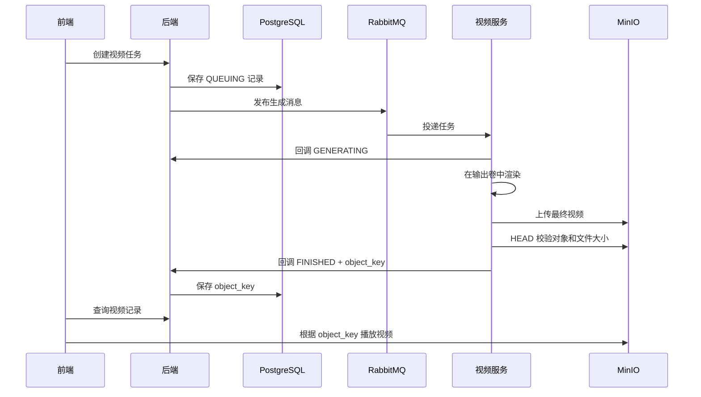

# 数据持久化与数据库说明

## 1. 核心结论

系统按数据性质分层保存：

- **PostgreSQL** 保存**业务数据和文件索引**，例如学习计划、任务大纲、题目、作答、生成状态和视频对象键。
- **MinIO** 保存最终生成的**视频文件**。MinIO 是兼容 S3 协议的对象存储，适合保存 MP4 等大文件。
- **Docker 输出卷** 保存视频渲染过程中的**临时文件和中间产物**，仅作为生成工作区，不是最终文件库。
- **Education2D 数据卷** 保存**互动 2D 内容的版本化 JSON**。
- **RabbitMQ 和 Redis** 用于异步任务传递及状态缓存，不作为长期业务数据主库。

最重要的访问关系是：

```text
PostgreSQL 保存“资源记录和存储位置”
                    ↓ object_key
MinIO 保存“真实的视频文件”
```

数据库一般不直接保存 MP4。它保存视频属于哪个资源、生成状态以及视频在 MinIO 中的 `object_key`；真正的视频文件保存在 MinIO对象存储。

## 2. 各类数据存在哪里

| 数据 | 保存位置 | 保存内容 | 读取方式 |
| --- | --- | --- | --- |
| 学习主题、阶段、任务大纲 | PostgreSQL | 标题、描述、顺序、状态、层级关系和进度 | 前端调用后端 API，后端查询数据库 |
| 课前测试题、任务小测题 | PostgreSQL | 题干、选项、答案、解析、用户作答和答题状态 | 后端按学习主题、任务或小测查询 |
| 深度解析 | PostgreSQL | 结构化 Markdown 正文 | 后端返回 `content` 字段 |
| 知识导图 | 不单独存文件 | 前端把深度解析 Markdown 实时转换成 Markmap 导图 | 先读取 Markdown，再在浏览器生成 SVG |
| 视频业务记录 | PostgreSQL | 提示词、状态、`object_key`、公开标记和时间 | 后端 API 查询 |
| 最终知识视频、代码视频 | MinIO / S3 兼容对象存储 | MP4 等最终视频文件 | 根据存储配置和 `object_key` 访问 |
| 视频渲染中间文件 | Docker 输出卷 | 渲染素材、中间视频、元数据和任务工作目录 | 仅视频服务内部使用，按生命周期自动清理 |
| 互动 2D 内容 | `education2d-data` 数据卷 | 当前版本、历史版本和可视化规格 JSON | Education2D viewer/API 读取 |
| 异步生成消息 | RabbitMQ | 等待生成服务消费的任务消息 | 由各生成服务消费 |
| 视频任务状态缓存 | Redis | Celery 任务队列、状态和临时结果 | 由视频服务内部读取 |

## 3. 数据如何写入和读取

### 3.1 普通业务数据

用户创建学习主题、提交答案或更新学习进度时：

```text
前端请求后端 API
  -> 后端完成身份、权限和参数校验
  -> 使用数据库事务写入 PostgreSQL
  -> 前端再次通过后端 API 查询
```

前端不直接连接 PostgreSQL。所有学习计划、任务、题目、作答和资源归属都由后端统一读写和鉴权。

学习计划按以下关系结构化保存，而不是保存为服务器目录中的单个大纲文件：

```text
study_subject（学习主题）
  -> study_stage（阶段大纲）
       -> study_task（任务大纲）
```

课前测试题保存在 `pretest_problem`；任务小测通过 `study_quiz -> study_quiz_problem` 保存，因此同一个任务可以保留多次练习记录。

### 3.2 AI 生成数据

AI 任务采用“先创建记录、再异步生成、最后回写结果”的方式：

```text
后端在 PostgreSQL 创建 QUEUING 记录
  -> 任务发送到 RabbitMQ
  -> 生成服务开始处理并回调 GENERATING
  -> 生成完成后回调 FINISHED 或 FAILED
  -> 后端保存最终内容或文件引用
```

- 题目、学习计划和深度解析等结构化内容，由生成服务回调后直接写入 PostgreSQL。
- 视频等大文件先上传 MinIO，回调只把 `object_key` 写入 PostgreSQL。
- 前端通过资源 ID 查询数据库中的生成状态，不需要保持长时间 HTTP 连接。

## 4. 视频如何保存和播放

### 4.1 最终视频保存在 MinIO

MinIO 是**对象存储**。文件以“桶 + 对象键”的形式保存，不依赖传统服务器文件路径。

当前默认桶示例为：

```text
zhiying-content
```

对象键按视频类型区分：

```text
knowledge-videos/<resource_id>-<uuid>.mp4
code-videos/<resource_id>-<uuid>.mp4
```

例如数据库中保存：

```text
knowledge_video.id = 125
knowledge_video.status = FINISHED
knowledge_video.object_key = knowledge-videos/125-xxxx.mp4
```

实际文件位于：

```text
MinIO / zhiying-content / knowledge-videos/125-xxxx.mp4
```

读取时，前端先从后端获得 `object_key`，再结合公共存储地址和桶名组成视频 URL：

```text
<STORAGE_PUBLIC_BASE>/<STORAGE_BUCKET>/<object_key>
```

### 4.2 一次视频生成的完整流程



只有在 MinIO 上传成功，并通过对象存在性和文件大小校验后，系统才会把任务标记为 `FINISHED`，从而避免数据库指向一个未成功上传的文件。

### 4.3 视频渲染中间文件

Knowledge2Video 和 Code2Video 在独立 Docker 输出卷中工作：

```text
knowledge-video-output:/outputs
code-video-output:/outputs
```

每个任务使用独立目录：

```text
/outputs/tasks/<celery_task_id>/
```

这些目录保存渲染所需的大纲、分镜、素材、元数据、中间视频和最终本地文件，使 API、worker 和 bridge 可以共享同一批产物。它们不是前端读取的正式文件库；对外可用的最终视频以 MinIO 对象为准。

中间文件理论上也可以改为对象存储，但渲染过程需要频繁创建、修改和读取大量临时文件，直接使用本地卷通常更简单、速度也更稳定。适合长期留存或跨机器共享的最终文件和关键工件，再上传对象存储更合理。

## 5. 本地文件清理和垃圾回收

视频输出卷已按任务生命周期进行管理：

- **成功任务**：MinIO 上传并校验成功后，不立即删除本地文件；默认延迟 6 小时再清理，便于短时间排障。
- **失败任务**：保留失败现场，默认 24 小时后清理，避免失败目录无限占用磁盘。
- **运行中任务**：使用活动标记保护，清理器不会删除仍在执行的任务目录。
- **删除前复核**：清理最终本地视频前会再次通过 MinIO `HEAD` 请求确认对象存在且大小一致。
- **磁盘告警**：输出卷达到容量阈值或剩余空间不足时记录结构化告警，并可发送到配置的 Webhook。
- **异常中断保护**：过期的活动标记会在超过安全时限后被识别，防止永久阻塞清理。

系统还会定期执行跨 PostgreSQL 和 MinIO 的垃圾回收：

- 清理超过宽限期、已结束、没有用户关联且没有学习任务引用的资源记录；
- 清理 MinIO 中超过宽限期、但已没有任何数据库记录引用的孤立视频对象；
- 只扫描 `knowledge-videos/` 和 `code-videos/` 前缀，避免影响其他对象；
- 删除前再次检查引用关系，降低并发情况下误删有效资源的风险。

普通用户删除资源时，主要是解除用户与资源的关联。真实记录和文件由后台垃圾回收在确认无引用并超过宽限期后处理。

## 6. 互动 2D 内容

互动 2D 内容当前不保存在 MinIO，而是保存在 `education2d-data` Docker 卷中：

```text
/data/visualizations/<visualization_id>/
  index.json
  versions/
    <version_id>.json
```

PostgreSQL 中的 `interactive_html.object_key` 保存类似下面的引用：

```text
education2d:<visualization_id>
```

前端看到该前缀后，会打开 Education2D viewer；viewer 再从数据卷读取当前版本 JSON。普通容器重启不会删除数据，但删除 `education2d-data` 卷会造成内容丢失。

## 7. 持久化、清理和备份边界

| 存储 | Docker 卷 | 主要用途 | 删除卷的影响 |
| --- | --- | --- | --- |
| PostgreSQL | `postgres-data` | 业务主数据和文件引用 | 学习数据、题目、作答和资源记录丢失 |
| MinIO | `minio-data` | 最终视频对象 | 已生成视频文件丢失 |
| Education2D | `education2d-data` | 互动内容版本 | 互动内容无法读取 |
| 视频输出目录 | 两个 video output 卷 | 渲染中间文件 | 不影响已确认上传到 MinIO 的最终视频，但会失去本地排障材料 |
| RabbitMQ / Redis | 对应数据卷 | 消息、队列和任务状态缓存 | 可能丢失待处理任务或缓存，不等同于业务主数据丢失 |

Docker 卷只能保证数据不随普通容器重建而消失，**不能代替备份**。

仓库提供 PostgreSQL 和 MinIO 的配套脚本：

```bash
sh scripts/backup-data.sh
```

备份会在短暂暂停写入服务的维护窗口内，同时生成：

```text
backups/<timestamp>/
  manifest.json
  SHA256SUMS
  postgres/database.dump
  minio/<bucket contents>
```

这样可以保持数据库中的 `object_key` 与 MinIO 中的真实对象尽量一致。只备份 PostgreSQL 会留下无法播放的视频引用；只备份 MinIO，则无法知道对象对应哪个用户或业务资源。

恢复是破坏性操作，需要显式确认：

```bash
RESTORE_CONFIRM=restore-postgres-and-minio \
  sh scripts/restore-data.sh backups/<timestamp>
```

`education2d-data` 不在上述 PostgreSQL + MinIO 脚本的备份范围内，需要单独做卷快照或目录备份，并尽量与数据库备份处于同一维护窗口。

## 8. 一句话总结

系统以 **PostgreSQL 管理结构化业务数据和引用，以 MinIO 保存最终视频，以 Docker 输出卷承载临时渲染工作，以 Education2D 数据卷保存互动内容版本**；所有业务数据通过后端 API 存取，临时文件和无引用对象由生命周期清理及垃圾回收控制，PostgreSQL 与 MinIO 配套备份和恢复。
