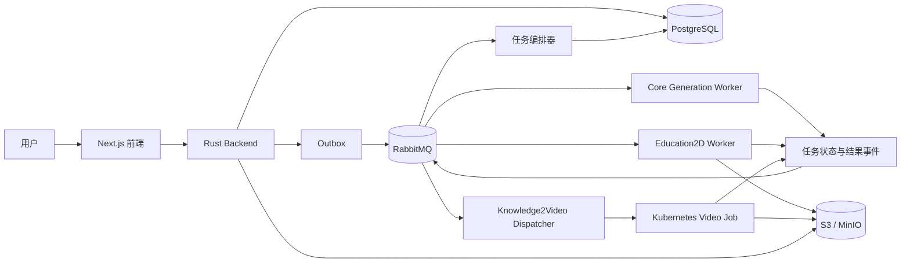

# 智映通学消息队列与云原生架构设计

> 本文用于项目展示与技术介绍，说明智映通学在继续接入 Education2D、Knowledge2Video 和更多生成类微服务时采用的整体架构。

## 1. 为什么需要这套架构

当前项目已经通过 RabbitMQ 接入真实的 `core-generation` 微服务，用于生成课前测、个性化学习计划、知识解析和课后测。

后续还需要接入：

- **Education2D**：生成可交互的二维教学可视化；
- **Knowledge2Video**：使用大模型、TTS、Manim 和 FFmpeg 生成教学视频；
- **其他生成服务**：例如交互式 HTML、代码视频和更多 Agent 服务。

这些任务的执行时间从几秒到数小时不等，资源需求也不同。如果全部使用同步 HTTP 调用，容易出现请求超时、服务互相阻塞和高峰流量击穿生成服务等问题。

因此，项目采用：

```text
RabbitMQ 消息队列
+ PostgreSQL 任务状态
+ S3/MinIO 对象存储
+ Kubernetes 弹性调度
```

形成统一的异步微服务架构。

## 2. 总体架构



架构分为两部分：

- **控制面**：Backend、PostgreSQL、RabbitMQ 和任务编排器，负责任务创建、排队、状态、重试和结果管理；
- **执行面**：不同类型的 Worker 或 Kubernetes Job，负责实际生成内容。

平台只规定统一的任务协议，不限制微服务使用的语言。现有 Rust、Python 和 Node.js 服务都可以按相同方式接入。

## 3. 我们采用的核心设计

| 设计 | 为什么采用 | 主要好处 | 局限性 |
|---|---|---|---|
| RabbitMQ 任务队列 | 项目主要是“后端派发任务、Worker 异步处理”的工作队列场景 | 削峰、解耦、消息确认、重试、路由隔离 | 不适合永久保存海量日志和分析事件 |
| 每种能力独立队列 | 文本、Agent、视频任务的耗时和资源差异很大 | 一个服务故障不会阻塞其他服务，可独立扩缩 | 队列和配置数量会增加 |
| Outbox + Inbox | 数据库和消息队列之间无法直接保证一个事务 | 避免任务丢失，并安全处理重复投递 | 系统采用最终一致，状态不会瞬间完成 |
| PostgreSQL Task Ledger | RabbitMQ 不应该作为任务状态数据库 | 统一保存排队、运行、成功、失败和重试状态 | 需要增加任务状态表和编排逻辑 |
| S3/MinIO 对象存储 | 视频、图片和大型 Spec 不适合放入消息队列 | 支持跨节点执行、大文件分发和阶段检查点 | 需要管理对象生命周期和访问权限 |
| Kubernetes + KEDA/HPA | 不同任务需要不同资源，并且负载存在明显波动 | 自动扩缩、资源隔离、故障恢复 | 部署和运维复杂度高于单机 Compose |

## 4. 消息队列设计

### 4.1 命令与事件分离

消息分为两类：

| 类型 | 作用 | 示例 |
|---|---|---|
| 任务命令 | 通知某个微服务开始执行 | `task.education2d.requested.v1` |
| 任务事件 | 汇报运行、进度、成功或失败 | `task.knowledge-video.succeeded.v1` |

建议使用两个 Topic Exchange：

```text
x.zhiying.task.command.v1
x.zhiying.task.event.v1
```

每种能力使用独立队列，例如：

```text
q.zhiying.pretest.command.v1
q.zhiying.education2d.command.v1
q.zhiying.knowledge-video.command.v1
```

新增微服务时，只需要定义新的 Routing Key、Queue 和消息 Schema，不需要改变其他消费者。

### 4.2 统一消息格式

```json
{
  "message_id": "全局唯一消息 ID",
  "task_id": "业务任务 ID",
  "capability": "knowledge-video",
  "schema_version": 1,
  "idempotency_key": "knowledge-video:84721:v1",
  "attempt": 0,
  "deadline": "2026-07-19T01:00:00Z",
  "data": {
    "knowledge_point": "二分搜索",
    "language": "Python"
  }
}
```

- `message_id`：用于消息去重和日志追踪；
- `task_id`：贯穿一次任务的完整生命周期；
- `idempotency_key`：防止重复点击或重复投递产生两份结果；
- `schema_version`：支持消息协议升级；
- `attempt` 和 `deadline`：用于重试和超时控制。

消息队列只传递小型 JSON。视频、图片、大型可视化文件和中间产物保存到 S3/MinIO，消息中只传对象地址。

### 4.3 可靠性机制

```text
Backend 在同一个数据库事务中写入业务数据和 Outbox
    ↓
Outbox Relay 将任务发布到 RabbitMQ
    ↓
Worker 使用 Inbox 和幂等键领取任务
    ↓
执行成功或失败后发布任务事件
    ↓
任务编排器幂等更新 PostgreSQL 状态
```

可恢复错误按照 30 秒、5 分钟和 30 分钟分级重试；非法消息或超过重试次数的消息进入死信队列，并触发告警。

这套架构采用“至少一次投递 + 业务幂等”，不强行追求跨数据库和消息队列的绝对“恰好一次”。

## 5. 不同微服务如何接入

| 服务 | 特点 | 接入方式 |
|---|---|---|
| Core Generation | 文本和 JSON 生成，通常数秒到数分钟 | 常驻 RabbitMQ Worker |
| Education2D | 多轮 Agent 工具调用，通常数分钟 | 独立 Node.js Agent Worker |
| Knowledge2Video | Manim、FFmpeg、TTS，可能运行数小时 | Dispatcher + Kubernetes Job |
| CodeVideo | 可能执行生成代码，安全风险较高 | 独立沙箱 Job 和隔离节点池 |

### 5.1 Education2D

- 首次生成和复杂自然语言重构通过 RabbitMQ 异步执行；
- Patch、Undo/Redo 等低延迟操作继续使用同步 API；
- 保留严格 Schema、固定组件、原子修改和不可变版本设计；
- 版本从本地文件迁移到 PostgreSQL 或对象存储；
- Agent 进度通过任务事件推送，断线后仍可查询最终状态。

### 5.2 Knowledge2Video

Knowledge2Video 当前使用 FastAPI、Celery 和 Redis，可以分两步接入：

1. 先增加 RabbitMQ Adapter，将平台任务转交给现有 Celery Worker；
2. 再演进为 Dispatcher 创建独立 Kubernetes Job。

视频任务使用独立 Job，主要是因为它可能运行数小时并占用大量 CPU、内存和磁盘。Job 完成后将视频和阶段检查点上传到 S3/MinIO，再通过任务事件通知平台。

这样可以避免一个视频任务长期占用消息连接，也可以在失败后从最近的阶段继续执行。

## 6. 云原生部署设计

| 组件 | Kubernetes 形式 | 扩缩方式 |
|---|---|---|
| Frontend、Backend | Deployment | HPA 根据请求量、CPU 和延迟扩缩 |
| Core、Education2D Worker | Deployment | KEDA 根据 RabbitMQ 队列积压扩缩 |
| KnowledgeVideo Dispatcher | Deployment | 少量固定副本 |
| KnowledgeVideo 执行器 | Job | 每个视频任务独立创建 |
| 清理、对账、死信检查 | CronJob | 定时执行 |

资源按照任务类型隔离：

- 文本任务使用普通 CPU 节点；
- Agent 任务设置独立 CPU 和内存限制；
- 视频渲染使用高 CPU 或 GPU 节点池；
- 1080p 和 4K 视频使用不同队列与资源规格；
- 代码执行使用 gVisor/Kata 等沙箱，并限制网络和文件权限。

KEDA 可以根据队列长度增加 Worker，但最大副本数仍受模型供应商并发额度、数据库连接数、节点资源和成本预算限制。

## 7. 数据存储职责

| 数据 | 存储位置 |
|---|---|
| 用户、学习计划和内容元数据 | PostgreSQL |
| 任务状态、重试次数和结果引用 | PostgreSQL Task Ledger |
| 视频、图片、Spec 和中间产物 | S3 / MinIO |
| 缓存、限流和短期进度 | Redis |
| 等待执行的任务和状态事件 | RabbitMQ |

PostgreSQL 和对象存储保存最终数据；RabbitMQ 负责任务传递；Redis 只保存可以重新构建的临时数据。

## 8. 主要收益

- **解耦**：用户请求、Backend 和生成服务不再同步等待彼此；
- **削峰**：高峰任务先进入队列，不会直接击穿大模型和视频服务；
- **扩展**：新微服务只需实现统一任务协议；
- **可靠**：Outbox、Inbox、重试和死信队列减少任务丢失；
- **隔离**：文本、Agent、视频和代码任务使用不同资源池；
- **弹性**：Worker 根据队列积压自动扩缩；
- **可观察**：通过统一 `task_id` 追踪任务、耗时、错误和成本。

## 9. 主要局限

- 引入 RabbitMQ、任务账本和 Kubernetes 后，部署与运维复杂度会提高；
- 系统采用最终一致，用户需要看到明确的排队和运行状态；
- 至少一次投递无法完全避免昂贵计算被重复执行，需要幂等、缓存和阶段检查点；
- Kubernetes Job 存在镜像拉取和 Pod 启动的冷启动时间；
- RabbitMQ 适合任务派发，但不适合长期海量事件分析。未来如有大规模事件回放需求，可单独增加 Kafka。

## 10. 实施顺序

1. 加固现有 RabbitMQ 链路，补充消息 ID、幂等、重试和死信队列；
2. 增加 Task Ledger、Outbox 和统一任务状态查询；
3. 接入 Education2D，并迁移版本与进度存储；
4. 使用 RabbitMQ Adapter 接入现有 Knowledge2Video；
5. 将生成文件和检查点迁移到 S3/MinIO；
6. 将视频任务演进为 Dispatcher + Kubernetes Job；
7. 引入 KEDA、HPA、链路追踪和告警。

## 11. 总结

智映通学采用：

```text
RabbitMQ
+ PostgreSQL Task Ledger
+ Outbox / Inbox
+ S3 / MinIO
+ Kubernetes / KEDA
```

RabbitMQ 负责可靠派发任务，PostgreSQL 保存任务和业务状态，对象存储保存大型生成结果，Kubernetes 根据任务类型进行资源隔离和弹性调度。

短时文本与 Agent 任务使用常驻 Worker，长时间视频任务使用 Dispatcher 和独立 Job。该设计可以在保留现有真实微服务实现的基础上，清晰、稳定地接入 Education2D、Knowledge2Video 和更多生成服务。
